[TOC]

# Javacore章节阅读小节

## java介绍

###  1. Java 的特性

​	java的十一种特性

1.  Simple （砍掉c++ 烦躁的功能， 并且更小能在嵌入设备使用）

2. Object-Oriented 接口取代多重继承

3. Distributed 基于socket 的各种网络协议实现的

4.  Robust   有编译器发现很多运行错误、用指针模型防止内存重写和数据修改。

5. Secure   想用沙箱运行未收信任代码，但是有bug

6. Architecture-Neutral 编译器编译成字节码文件并在不同的jvm进行运行。 （jvm运行原理）

7. Portable

8. Interpreted      jshell 的支持快速探索性的编程 （解释性的新增考点）

9. ### High-Performance  just-in-time compiler 

10. Multithreaded   返回 和实时 行为

11. Dynamic

### 2.java历史简介

* 一开始要做机顶盒等嵌入设备特质语言不行做了浏览器，然后才被接受

  Java 从1.0 发布历程主要如下

  1.1 有的反射

  java6 2006 发布 到2011 发布java7 （因为公司经营不良）

  java8 易于多线程运行表达式（线程的控制需要了解）

  java9 的模块化工作是从2008年开始的 11年花费 2017 年发布

  现在java 没六个月发布一次版本，现在长期稳定更新的java11

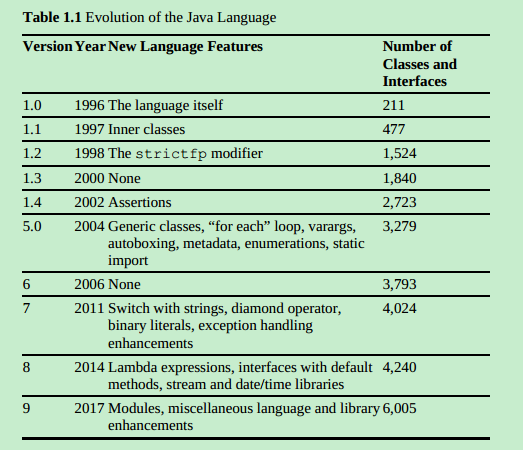

### 3.Java的免费版本是openjdk

（jdk 中的源码只有公共lib 的源码编译器，虚拟器需要下载)

### 4.  Java9中的jshell

* jshell java 9 开始的使用

  Math. + tab 键所有可运行的方法 命令敞口的方法名补全

  jshell 

  可以学习java语言和类库方法。

### 5.  面对过程编程和面对对象编程的区别

* 编程就是算法+数据结构
* 面对过程是先算法再数据结构，面对对象反之。

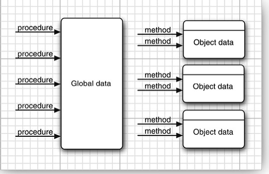

## java 运行环境

* 官网下载，装上配置环境变量，能用就可以。（jdk api 可以看看）

## java编程基础知识点（数据类型、操作符、控制流等）

### 1. 程序的开始main

main 方法必须且是public 修饰，java使用分号：来区别语句，有些换行就是比如linux自带的bash 脚本

### 2. Java的基本数据类型（浮点数需具体了解）

* 4种整数类型 2 种浮点类型 一种字符型 一种布尔型

* 0x 16进制 0 八位 0b 二进制 0b001_110_011 （可以添加下滑线让人识别）

* 0x1.0p-3 16进制用p代替e作为指数

* 为什么不使用浮点数做基本运算？

  {

  ​	折射因为浮点数在计算机里面的储存结构觉得的（是以科学计算法储存的）

  ​	由 符号位 + 指数位 + 尾数位 组成。

  ​	尾数位决定精度，float 的尾数位能表示7位，但是由于第一位1 是被省略的所以精度在7-8间。

  ​	注意：十进制|（有尽）数转成二进制可能有取不尽情况。

  ​	十进制小数转二进制的方法是 X2取整数位在继续X2 取整数位。 

  ​	如: 0.2 就会一直循环下去，所以进度会损失。

  ​	参考：http://www.cnblogs.com/jillzhang/archive/2007/06/24/793901.html

  }

### 3.   java的字符编码

* Java为了没有自己的编码方式，使用达到是utf -8 的编码

* 在\u0000 \uFFFF 这些16进制数之间 可以在非引号的地方使用 \u 会优先解析后面有没有16进制码

* 后来有了utf-16 因为2个字节 表示的字符到达上限（主要兼容中日韩字符）

  解决方法如下utf-16 编码U+1D546 and is encoded by the two code units U+D835 and U+DD46 可以解析为两个utf-8单元U+D800 to U+DBFF 是第一个单元 U+DC00 to U+DFFF for the second code unit 其余的是一个单独字符

  所以编程使用字符串操作不要用字符集，太容易出错。

### 4. Java 的常量和变量

* Java9 中_单个下划线变成保留字段不能再用来命名变量名了

  使用var 的前提是要初始化 根据初试化值获取类型（朱啊哟是java9中的一些改变）

  需要了解枚举的实现方法

### 5. Java的数字运算的一些古怪地方

* floorMod 解决取余是负数的情况

  StrictMath 应用在更看重结果的情况下 

  Strictfp 

  关键字 防止中间运算不同cpu 使用的寄存器位数，导致结果精度不同（不建议使用）

### 6. 数据转换

* int -> float long -.>double  都可能精度缺失（因为小数位限制）
* 需要理解浮点数的精度位数和表示的数的范围区别

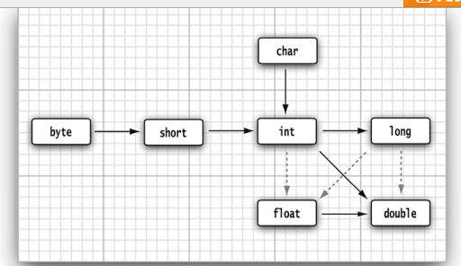

### 7. 运算符

* & (“and”) | (“or”) ^ (“xor”) ~ (“not”)

  运算符运算顺序 看看就好不用。

  

### 8. String 不是基本数据类型，（重要）

* String 不可变的原因方便编译器安排字符串的分享 在序列不变的情况下可以保证不同的变量使用相同的地址值（但相同序列，可能是不同的地址值，和jvm有关）

  String 并不一定有code unit 序列 组成 java9中使用单个 byte 数组来实现

  String 

  实现了CharSequence ，本身是一个final类。

### 9. 字符串的格式化操作

* 可能用到）% 开头（基本数据，分隔符，时间），可对同一个变量进行不同的格式化

  可能可以进行操作

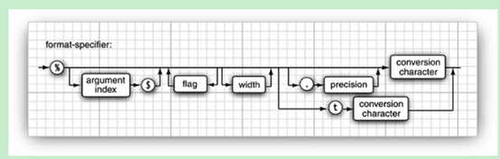

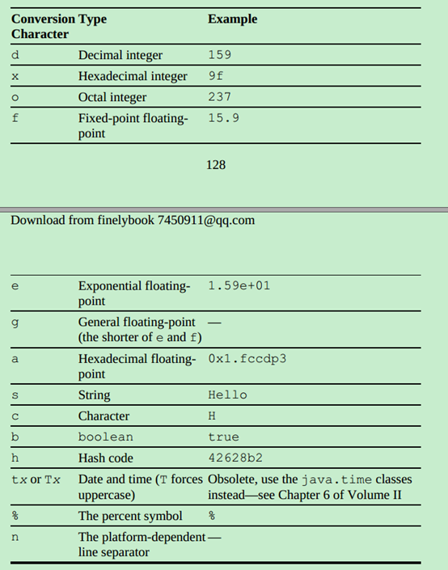

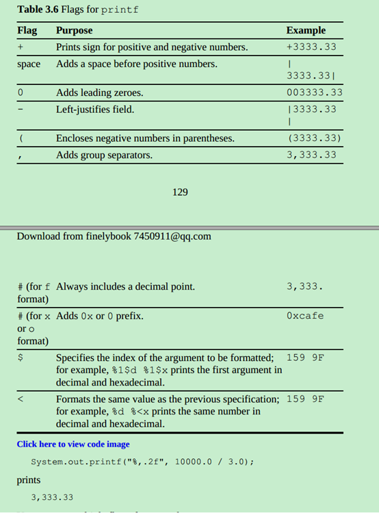

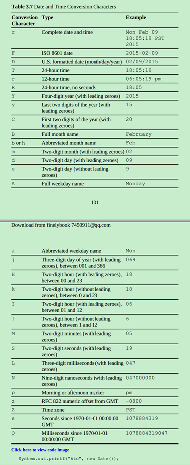

### 10、控制语句

* 都可以使用while 语句书写，没人用的do while 语句，不用浮点数控制循环，十进制转二进制有精度损失。break和continue 用于替代部分goto功能。

  < 和 <= 取值区别 <= 会夺去一个值 一般是i=1 的情况下

  for each 

  功能的使用需要实现iterable 接口。

### 11、数据和简单排序

* 快速排序法需要了解

  普通随机非重抽取原则。

  随机抽取，随机抽取吧最后一个放到抽取的位置，缩短总长度，去重。

- Java 中的多重数组

  多列数组int[][] 形式 java中的没有多为数组是一个数组包含多个数组的引用

  使用多维数组我们可以构建各种* 排列方式乘法表 多维数组内的子数组长度是不固定

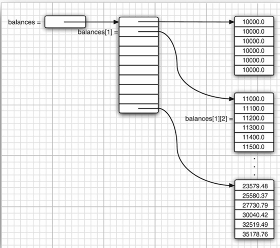

### 12、java字符转译和unicode值

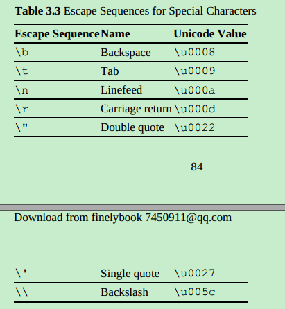

## 对象和类（Objects and Classes）

### 1、面对对象编程

* 算法 + 数据结构 = 编程 oop 是先数据结构在编程，面对过程反之

  Object 由下面三个标识组成 三个标识 state 、 behavior 、identity（区别相同的state的behavior）


### 3、类之间的关系、类和实例区别、对象和对象变量之间的关系

- 类的依赖关系 use-a has-a is-a

  类是一类对象的蓝图

  对象变量是对对象的地址值引用

  下图uml对象关系线（看文档用的）

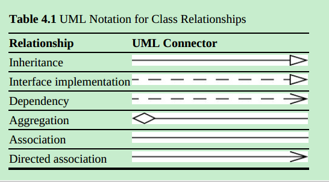

### 3、LocalDate 代替 Date类

* Java 旧版本使用Date 同时表示时间和日历

  java Date 时间是00:00:00 UTC, January 1, 1970 开始的一个the number of milliseconds

  很难和人类使用的日历进行转换，在java8中加入LocalDate 这个类简化了时间相关的操作（**LocalDate 只能够初始糊一次**，**是不可变元素**）

- java 过时代码的检测 可以使用相应工具

  The JDK provides the jdeprscan tool for checking whether your code uses deprecated features of the Java API. See https://docs.oracle.com/javase/9/tools/jdeprscan.htm for instructions.

### 4、访问方法和改变方法

- mutator method 改变原对象

  accessor method 访问对象

  jdk 中很多方法虽然传入的引用对象，单返回的一个新对象，而不是改变原有对象，所需要记住使用对象变量接受新的对象引用（如LocalDate 等）

  访问器访问可变对象造成线程并发错误

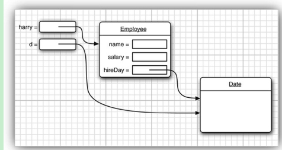

### 5、内部类的编译特点

* 内部类 和public类在编译的时候会生成两个class文件 （是两个class文件）

  编译时会自动编译import 的java 文件 （会根据.java版本号判断是否要编译替代已有的class文件）

### 6、构造器的使用

1. 构造器的特点

   a)      A constructor has the same name as the class.

   b)      A class can have more than one constructor.

   c)      A constructor can take zero, one, or more parameters.

   d)      A constructor has no return value.

   e)	  A constructor is always called with the new operator

2. 构造参数需要注意

   防止为null Objects.requireNonNullElse(source,replace) 替代

   Objects.requireNonNull(n, "The name cannot be null")  抛出异常

   对象哪些值是必要， 哪些是可以为空的 ，非基本类型 作为成员变量是默认

   null tough love

### 7、隐式参数和显式参数

- this 关联隐式参数（调用者本身也是作为参数进行传递的）

  对象实例调用方法，自己是作为隐式参数传递的 (方法名字之前) implicit parameter the target or receiver of the method call

- 显式就是括号里面的

### 8、Java 方法的inline （内联）

- 不把常用函数弹栈，提高使用效率

  具体概念参考：<https://blog.csdn.net/guyuealian/article/details/53138770>

- java中的方法都在类中但是不是inline 由jvm 由that are short, commonly called, and not overridden, and optimizes them away

### 9、Java 对象的封装

* 感觉访问器和改变器 ，感觉现在不怎么用到(用的最简单的set、 get方法)
* As a rule of thumb, always use clone whenever you need to returna copy of a mutable field （我总是返回可操作性对象，并直接改变值，我就是怎么操作的啊）
* 一直返回克隆对象写起来有时候并不方便，仅做参考需要进一步商议。（可能有现车问题）

### 10、基于类的访问权限 public 和private

- 相同类实例可以直接访问互相的私有变量（惊了）

  Ex：

  ```java
  class Employee
  {
  ​        public boolean equals(Employee other)
  ​        {
  ​        return name.equals(other.name);
  ​        }
  }
  ```

### 11、final 修饰符

* final修饰 的成员必须在构造器结束前被初始化，该成员变量的赋值是在构造是完成的。

### 12、static 修饰符

- 标明成员变量、常量或者方法属于类，而不是任何实例

- native 方法可以绕过java 机制给 常量赋值啊（我的试试 如System.out 会匹配系统）

  静态方式是没有隐式参数的（但是静态方法可以静态变量或者常量）

- 工厂类模式 （静态获取实例对象）

  使用工厂累的原因{

  1、 构造器名称必须和类相同，可以获取不同类的实例 如货币进制的例，或者百分比实例（格式胡）（但是参数是一样的）

  2、 使用构造器变化构造对象类型（生产的两个实例对象的类都是NumberFormat 的子类）{

  > NumberFormat currencyFormatter =NumberFormat.getCurrencyInstance();
  >
  > NumberFormat percentFormatter = NumberFormat.getPercentInstan        

  }

### 13、main 方法为什么是静态方法

- 因为静态可以不创建任何实例就可以调用（从来没有想过）

  通过这个方法开始创建所需的实例

- 使用supplier 是构造实例的函数，可以用来快速生成空参构造的实例

  如 可以 Supplier<String> supplier = String::new;（构造应用，在获取泛型实例可以使用）

  是快速定义一个空参实例，这个实例甚至可以是一个静态方法的实例，专门用来提供这个方法。 使用上述写法 新建是get（） 调用时候才生成实例是写法更加优雅。

  参考：

  <https://stackoverflow.com/questions/40244571/when-we-should-use-supplier-in-java-8>

  其中一种通过两个构造函数方便测试，在正常调用不用穿一个空参的时候实现测试

  LocalDate().now() 就不需要参数,不需要参数的静态方法

  其实就是给空参方法（构造方法、普通方法）一个可以简化使用语法的接口。

  注意是调用get（）的时候才进行对象的构造。

### 14、方法参数 基本数据类型和引用数据类型

- Java方法中传递的是值 （引用类型传递是地址值）

  the method gets a copy of all parameter values （java是给你一份备份）

  引用是地址值备份。

- 如何证明java 的引用参数值值传递  传两对象引用x,y，在方法内进行引用交换（原值参数引用值不会发生改变） 嗯值传递值传递。

  [^原文]: This demonstrates that the Java programming language does not use call byreference for objects. Instead, object references are passed by value

- java 方法由于是值传递能对产生的影响

  a)      A method cannot modify a parameter of a primitive type (that is,numbers or boolean values).

  b)      A method can change the state of an object parameter.

  c)	  A method cannot make an object parameter refer to a new object

基本数据传递是以图

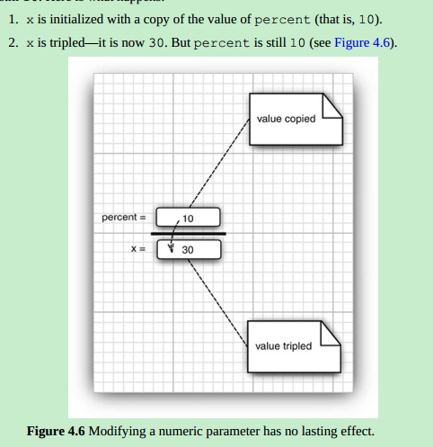

引用数据传递是以图

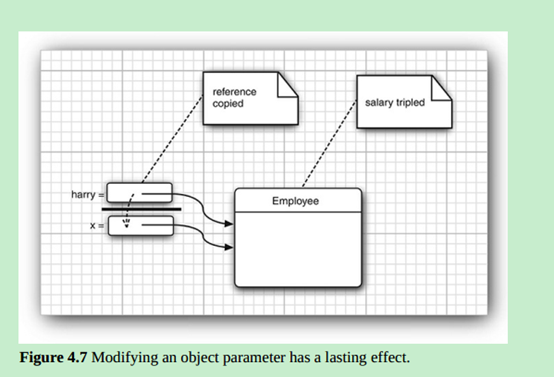

java对象传递是值传递而非引用传递示意图

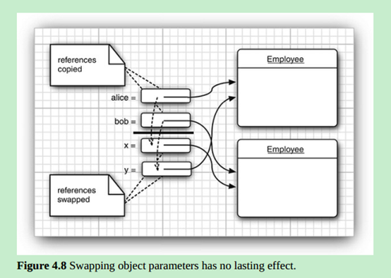

### 15、对象构造初始化顺序

- 可以在构造器中使用 this 调用同类中别的构造器
  （非常诡异）

  1.  If the first line of the constructor calls a second constructor, then the second constructor executes with the provided arguments.    （调用别的构造器）

  2. Otherwise,

     a. All data fields are initialized to their default values (0, false, ornull). （先声明初始化）

     b. All field initializers and initialization blocks are executed, in the order in which they occur in the class declaration.（代码块）

  3. The body of the constructor is executed

- Java先加载别的构造器，一般是父类构造器，因为需要父类的对象才能使用父类的方法和成员变量通过父类的对象。
  一般的新建会有多个实例产生，至少有个object.（这是我自己想的）

### 16、静态代码块

- 在类加载的时候执行一部门代码

  Java6 

  可以在静态代码块运行hello world

### 17、对象的销毁和finalize 方法

- add a “shutdown hook” with (初学者没得用)the method Runtime.addShutdownHook. As of Java 9, you can use the Cleaner class to register an action that is carried out when an object is no longer reachable (other than by the cleaner).
- 不要受冻清理让 gc自动清理如果不会的话。

### 18、包的概念

1. 目的：主要目的是保证类名的唯一性

2. 用法：使用import 来引用别的包里面的public类 * 只能引用单包而不能引用复合包

3. 特点：Static Imports  可以引入金泰方法和静态属性 （可能清晰可能不清晰）

4.  运行：

   有包的的class 运行需要在包的最基本层运行（而且的全类名）

   javac com/mycompany/PayrollApp.java （编译和运行使用分隔符不同）

   java com.mycompany.PayrollApp

5. 包之间的访问权限

   默认同包之间可以互相访问

   类成员变量要标记私有防止同包类的访问

   classloader 不接受不用户自定义的java. 开头的包，第三方用jar 来防止外部影响

   java9 使用模块来封装包

### 19、类路径 及类加载顺序

- **classpath 是指向依赖的jar包**，可以通过指定，减少打出jar包所占体积（将公共依赖包房一起，和osgi一样）。

- c:\classdir;.;c:\archives\archive.jar （. 强调在当前目录）

  /home/user/classdir:.:/home/user/archives/'*' 引入该目录下的所有jar包

  使用mvn会自动帮你重新配置classpath

- Jvm 加载顺序（先看jdk-> 的在到类路径找类 -> 在当前目录找类 -> 在类路劲下的jar包中zhao）

  这些顺序都会去找如果找到多个会报错

  比起jvm  compiler 还会去比较版本决定是不是去重新自动编译 （这个版本更新怎么控制的）

  Ex:

  Suppose the virtual machine searches for the class file of the com.horstmann.corejava.Employee class. It first looks in the Java （ java.lang  等）API classes. It won’t find the class file there, so it turns to the class path. It then looks for the following files:

  /home/user/classdir/com/horstmann/corejava/Employee.class

  com/horstmann/corejava/Employee.class starting from the current directory

  com/horstmann/corejava/Employee.class inside/home/user/archives/archive.jar

  It searches for each of these classes in all of the locations of the class path.

### 20、类路径的配置

- a)      在运行的时候可以是有 -cp -classpath来指定运行的jar 包 （这样就可以不用总是上传jar包了）（所有jar包都需要罗列）

  `java -classpath /home/user/classdir:.:/home/user/archives/archive.jar MyProg`

  b)      直接配置环境变量不推荐：(有程序这样干过)

  export

  CLASSPATH=/home/user/classdir:.:/home/user/archives/archive.jar

  set CLASSPATH=c:\classdir;.;c:\archives\archive.jar

  c)      java.ext 放的jar就没了 但是可以放一起 （java9 废弃了）

  d)      `java --Djava.ext.dirs="C:\c_workspace\jbtlog\target\classes\lib"allinpay.jbt.log.LogApplication` （但是会不加载ext下的依赖）

  e)      java9 类可以从模块路径进行加载

  f)       自己实现类加载器

### 21、jar的使用

-  Jar 命令 （为了不让你那一个目录结构的class文件运行）

  `jar options file1 file2 . . .   cvf`（options一般）（还用很多参数）

  `jar cvf test.jar ./classes` 用于打包，会自动把jar依赖放到lib里面

- Manifest 文件 （清单）可以打包时设置

  可以设置主函数、类路径、依赖、和书写一些描述信息

  Main-Class: com.mycompany.mypkg.MainAppClass 可以配置主函数清单

- Jar 运行方式（为啥要有这玩意）

  windows javaw -jar (不会打开shell 窗口，java 会)，把jar 封装成.exe 运行多么二逼的想法（但是有）

  java9 有 multi-release JARs 兼容不同版本的jdk （兼容多个发行版本的新jar包）

  jar uf MyProgram.jar --release 9 Application.class （兼容多个发行版本的新jar包）只兼容jdk ，可以在mf文件中配置。

  Jar 是如何兼容多个版本jdk的

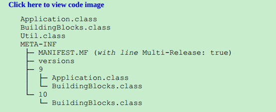

-  Jar命令（java9 改了随缘吧）

  一般都是-option，除了 操作tar 命令的签名没有 - 

  java9 有又改了 --module-path --version（概述作者认为单个字节的操作符容易产生误解）

  `jar -c -v -f jarFileName file1 file2 . . .` // 不能连起来写

  可能会用的jar 命令

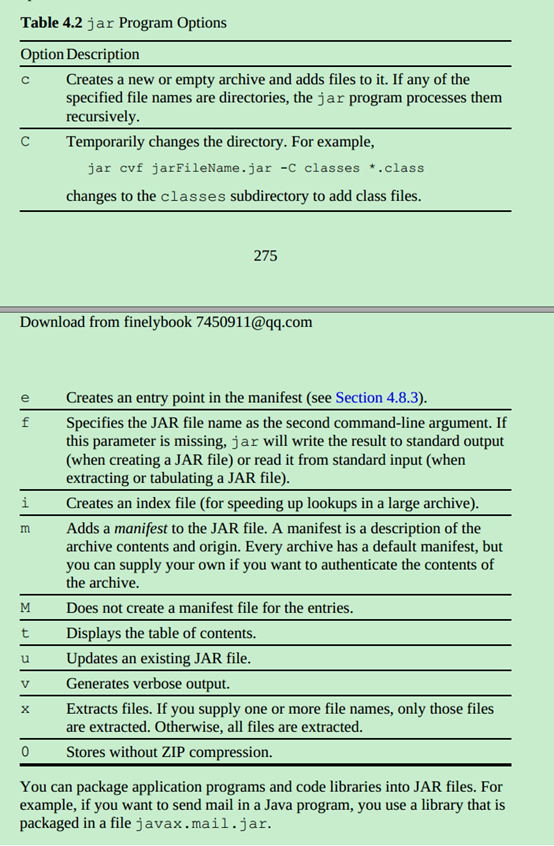

### 22、javadoc的操作（优点意思）

[^参考]:<https://blog.csdn.net/fanxiaobin577328725/article/details/52658781>

- subpackages 
  可以递归子文件夹

- 分为 {
      类注释
      方法注释
      字段注释
      一般注释
      包注释（需要大度穿件个文件用，package-info.java就好了）
  }

### 23、 Resource（资源路径配置）

- 资源包括{
      Image and sound files
      Text files with message strings and button labels
  }

- 获取方式{
      1、 直接通过类获取 类对象
      2、通过url
      3、通过  getResourceAsStream  读取

  ```java
  Class cl = ResourceTest.class;
  URL aboutURL = cl.getResource("about.gif");
  InputStream stream = cl.getResourceAsStream("data/about.txt"
  ```

  }

- 打包时操作

  将资源打入jar包中

  jar cvfe ResourceTest.jar resources.ResourceTest \

  resources/*.class resources/*.gif resources/data/*.txt corejava/*

  java -jar ResourceTest.jar      （现在的目录结构还是黑魔法吗都是jar 命令一点点做的）

  目录清单class lib resource mf文件（不要总是那么黑魔法了）

  InputStream java9 有readAllBytes() 的方法，java8 还得用数组去接麻烦（要会常用io类）

## 继承（Inheritance ）

### 1、类、父类、子类

#### 1. 基础特点

- is-a 关系是继承的特点

  super 和 sub 是集合概念superset subset

  父类是共有方法、子类是私有方法

  子类父类实例不共用私有变量，同类实例是可以的

  子类访问父类的私有变量的时候是通过父类的共有方法的（好像还没在子类方法中操作过父类变量呃 通过super 调用）

- **super和this是不同** （super不可以吧自己的值分配给其他的对象变量，this可以） （java 弱化了某些关系）

  this 和 super {

  1. this 自身实例引用

  2.  this调用自己的其他构造器

     super 调用父类的共有方法

  3. super调用父类的构造器

  }

#### 2. 子类构造方法必须先调用父类的构造**

- 会通过super 指令调用父类构造器 （java数数 到底有多少对象呢）

  调用父类构造器是因为子类构造器无法直接使用父类的私有属性

  构造器的优先执行对第一行的调用别的构造器

### 2、多态

#### 1、基本概念

- 父类对象变量可以引用子类实例，并调用子类重新实现的功能 （jvm
  know the type of object）

- 多态的本质是 动态绑定 （可以final修饰方法取消 就是不能重写了啊）

  父类应用子类时只能调用父类已有的方法（重新的调用子类的，但不能调用父类没有的）

- 注意： 虽然可以吧子类数组直接 转换为父类数组， 单无法存父类对象（数组类型由创建时确认，数组存如实会校验，存入数据的类型）

#### 2、多态中方法的调用过程（重要）

- 1、2 确定方法  3、4 进行绑定
  1. 首先找到对象的声明类型和方法名（包括重载的，父类和该类交这个名字的所有方法）
  2. 根据参数进行 overloading resolution （ 但是有与类型转换 过程很复杂 有基本数据强转，还有子类转换）
     子类重写父类方法是在返回类型兼容时可以 改变返回类型， 但是不能改请求参数、
  3. private, static, final, or a constructor 可以明确知道调用哪个方法 这些事（静态绑定方法）
     {
         静态绑定可以直接由隐式参数（调用者）的类型决定
         动态绑定的类型需要在运行时决定 （编译器和jvm 谁来决定呢  compiler 标明访问的方法 ，jvm 生成相应的实例进行访问（动态生成））
     }
  4. jvm会根据真实类型去调用方法，如果真实类型是子类实例，并且重写调用方法，则调用子类方法，否则通过调用父类方法
     jvm 会建立 a method table 罗列所有方法签名 和真实调用的方法 （调用父类方法会去访问查询父类的方法表）

- **动态绑定，是我们在不用更新代码的情况下添加额外的功能 （你不要去重新编译旧的代码，因为准确的类型是jvm去确定的）**

#### 3、final 修饰阻止继承

- final修饰的类只有方法是final修饰的，成员变量不是

  目的是为了是方法的实现不被改变，或者不会产生子类实例

  java中的多态是不需要标明直接使用的c++ 必须声明

  final 以前可以提高方法被内联的可能性 （但just-in-time compiler更加聪明）

#### 4、强转（父转子）

- 为了该对象的全部功能（父类引用转为子类引用） 向下强转

  强转前需要判断

  ​	使用 instanceof 判断后再近些强转

  ​	x instanceof C 不会 x为null 产生异常

#### 5、抽象类

- 通过abstract构造抽象类和方法，高度抽象一部风功能，该类变成其他类的组成，而不是具体实现。

- 特点：

  ​       1、普通方法和抽象方法共存

  ​       2、继承抽象类要么也是抽象类，要么实现所有抽象方法

  ​       3、抽象类无法实例化（有构造方法）但是只能引用子类实例

#### 6、protected 修饰符

- protected 允许子类访问父类的 成员 和方法

  protected 允许同一包所有其他类访问 ，不同包只能子类（注意）

  protected 的机制只允许子类访问自己内置的（调用父类构造的）父类变量（不会干扰到其他子类实例）

  主要用于修饰方法 （不将方法暴露给不是子类的类）

- 注意：

  有些特例Object 中的clone() 方法，不能直接被子类使用

  同包的类也可以访问protected方法修饰的类

#### 7、java的四种修饰符

1. Accessible in the class only (private).

2. Accessible by the world (public).

3. Accessible in the package and all subclasses (protected).

4. Accessible in the package—the (unfortunate) default. No modifiers are needed

### 3、Object类顶级父类

#### 1.基本概念

- 如果没有父类显示提及，就会继承这个类，所以是所有类的父类

  多线程有用到这个类。

#### 2、Object类型的引用

- 可以接受任何实例引用（也只能持有，没法使用特别功能）

  基本数据类型 不是Object 对象 （C++ 没有超类 ，反而把指针指向空指针 啥意思啊）

#### 3、equals方法

- 用于比较两个对象是否相等，默认比较地址值。

  由于一般比较的是实例的状态值，所以需要重写该方法，重写加上@Override进行注解。

- 重写步骤{
      1、调用父类的equals方法 Object父类是先比较地址值
      2、比较类是否相同
      3、进行强制比较具体的状态
  }

- equels重写需要遵守的规则 {
      1.  It is reflexive: For any non-null reference x, x.equals(x) should
          return true. （自反的）
         2.  It is symmetric: For any references x and y, x.equals(y) should
                 return true if and only if y.equals(x) returns true.	（对称的）
         3.  It is transitive: For any references x, y, and z, if x.equals(y)
                 returns true and y.equals(z) returns true, then x.equals(z)
                 should return true.		（传递的）
         4.  It is consistent: If the objects to which x and y refer haven’t changed,
                 then repeated calls to x.equals(y) return the same value.	（恒定的）
         5.  For any non-null reference x, x.equals(null) should return
                 false.

  }

- 个人认为的equals 写法 不要做非空判断{
  	1、调用父类equals方法（比较地址会）
    	2、判断类型（getClass ，子类用 instance of）
    	3、进行类型强转，比较需要比较的状态
  }

#### 4、hashCode()

- 默认的hashCode()返回的是对象内存地址

  和`equals` 是绑定的（`equals` 的方法`hashCode()`一样，`hashCode()`一样的一定`equals`（ 理论上应该)）

- 所以为了保证比较的可用一般会重写hashCode

  String和基本类型’封装类型都重写了hashCode()方法，根据内容返回，所以会返回相同的hashCode值，但很多对象是没有重写的

- 注意；

  相同的对象严格意义上要返回相同的 hash值 

  比如StringBuffer 使用的默认`hashCode()`方法，所以不能通过此进行比较。

  比较状态的化一般就是String+ 基本类型封装型。（没得集合这种自定义类型）

#### 5、toString()方法

- 内核类名+hash值

  Java 字符串操作会默认调用toString()方法

#### 6、getClass()方法

- 获取类信息对象，反射用到。

### 4、ArrayList(数组集合)

- 数组作为一种底层数据机构很少使用，ArrayList很像Array的一种封装类

#### 1、基本概念

- 解决数组大小初始化大小问题，提供随意增删元素的方式，底层还是数组帮你做一些操作。

  一般会用泛型规定所持有的数据类型

  `ArrayList<Employee> staff = new ArrayList<>()`  右侧的<> 叫做钻石语法服了

  ArrayLIst 比Vector 更高效（有一个失败者）

  数组长度是arrayList 自动维护的， ensureCapacity 可以规定数组长度在你知道确定的情况下 （避免再分配的消耗）

- 注意

  1、 `new ArrayList<>(100)` 和 `new Employee[100]`，数组会初始化并持有100个默认值list的`size()` 还是0

  2、使用`trimToSize` 可以删除多余的内存占用释放空间 （裁剪合适的内存块） 确定了就这个场独立不在改变了

  3、集合的容量 和 集合的大小是两个概念 capacity and size（所以集合也有容量只是会自动变淡）

#### 2、获取改变集合中的元素

- arrayList 不是java语言设计的一部分（获取 改变数据并不方便，需要通过专门的方法）

  ist.set(0, x);  只能用于替换，原位置必须已经有值

  arrayList 指定位置添加和删除元素时 都会copy指定位置后面的所有元素 （所以增删效率不高，why）

#### 3、数组和数组集合的区别

1. 长度是否可变

2. 是否有初始化值

3. 获取修改元素的方式不同（但都index 概念）

#### 4、类型限定和非类型限定的arrayList的区别

- java 编译报错是什么时候， java为了向下兼容会将所有的泛型 转换为非泛型限定 （编译检查但不编译进去，为了兼容性） 会涉及到泛型的擦除机制，具体参考泛型章节。

### 5、Object 封装器和自动封箱

#### 1、基本概念

- 基本类型都有对应的封装类型，用于操作基本类型，提供一些方法（如字符串转基本类型，`toString(int i, int radix)`不同进制显示数字）。

  封装器中的基本变量都使用了final 修饰都是构造时候初始化的，不能再改变

#### 2、特点

- 基本类型和其分装类的转换叫做自动装箱拆箱 （从C# 学来的的）

  `int n = list.get(i).intValue();` 这部分工作是由编译器帮你干的

  `ArrayLIst<Integer>` 由于封装的原因 效率远低于 int[]

#### 3、注意

1. 封装类的大小比较 -128 - 127 封装在固定的对象中地址值相同，其他不相同

2. 封装实例可以为null

3. 封装类型在运算符运行后也会升迁

​        Integer n = 1;

​        Double x = 2.0;

​        System.out.println(true ? n : x); // prints 1.0 (这样都会做类型升迁) 

4. 基本类型的自动拆装箱是编译器干的，jvm不负责，语言相关的语法糖基本都是编译器负责。

### 6、可变数量变量

#### 1、基本概念

- 本质是最后一个参数是Object[]数组（基本类型会自动装箱拆箱适应），用于参数不确定的情况下

  由编译器来解析。

  最常用的`prinf(String,Object... )`方法

#### 2、特别的写法

- `System.out.printf("%d %s", new Object[] { new Integer(1), "widgets" } );` （你这样写编译器就不用干活了）

  可以这样写主方法

  `public static void main(String... args)` (惊了 还真可以)

### 7、枚举类

#### 1、基本概念

- 自定义特定类型，保证了参数的在给定的范围。

#### 2、特点

1. 枚举产生的枚举都是实例用 == 就好了 ，equals 是用于比较实例里面的数据类型

2. public enum Size { SMALL, MEDIUM, LARGE, EXTRA_LARGE } （里面可以完全没有属性）

3. 枚举的构造器默认是私有的

4. 枚举中的toString() 返回名称 如Size.SMALL.toString() 直接返回 “SMALL” 已近重写了toString()

#### 3、常用方法

- `Enum.valueOf(enumclass,name)` 根据枚举类型和名称获取 枚举实例

  `values()` 返回该枚举类型的数组

  `ordinal()` 返回顺序  zero-based

#### 4、注意事项

- 1. 这个类其实是 继承了Enum<classname> 但是被省略了For example, the enumerated type Size actually extends Enum<Size>

  2. `compareTo()` 根据定义的顺序返回

### 8、反射（重要）

#### 1、基本概念

- 通过java内置下工具类java.lang.reflect来分析一个类的功能。可以动态的操作Java代码，通过接口创建、类关系映射的等工具动态获取类的能力。

#### 2、反射的功能

 {
       1.  Analyze the capabilities of classes at runtime运行时分析类的能力
       2.  Inspect objects at runtime—for example, to write a single toString method that works for all classes运行时检查类    (debug这种）
    3.  Implement generic array manipulation code实现通用数组操作代码
    4.  Take advantage of Method objects that work just like function pointers in languages such as C++利用对象的方法

}

#### 3、Class类（类的信息）

- runtime type identification jvm 一直在做运行时类型校验 （这哪来的啊）

  类的信息可以通过 `getClass` 获取 （调用才会获取这个实例） 用于描述类的属性

- Class获取方法{
      实例`.getClass()` 获取
      `Class.forName`（类名） 来获取该类的class 对象
      类名.class 获取
  }

- getName()方法

  `getName()` 获取全类名

  main的启动就是我找我依赖的类，我依赖的类找他们依赖的类（击鼓传花）

- 注意事项

  1. int.class 也是可以的 虽然int不是class 直接装箱了

  2. 获取的Class 对象是有泛型限制的

  3. jvm 为每种类型创建唯一独特实例（父类子类 是单独的分类） 所以用 == 就可以比较是否相同了 （class 对象只会有一个啊）

- 用法

  可以获取构造器、成员变量、方法、信息对象然后可以做进一部分析。

#### 4、使用反射分析类结构功能（重要）

- 获取属性{
         1. 获取Class 对象
      2. 获取Field 对象
      3. `field.setAccessible(true)` 获取权限操作私有变量（也可以获取方法吧）
      4. `field.get(实例)`         获取该该实例的该变量值 （返回的是Object，不过类型你可以获得）
    使用 `field.set(实例，value)` 可以设置值

  }

  反射可以获取的包含 属性、方法、构造、修饰符 (总共四个类封装)，可以参考代码实现。

  这种获取权限的方式是可以被拒绝的在使用security manager 或者java 9

  module system 都需要单独处理 java9 中可以通过Lookup来获取权限

  java9 使用lookUp获取

  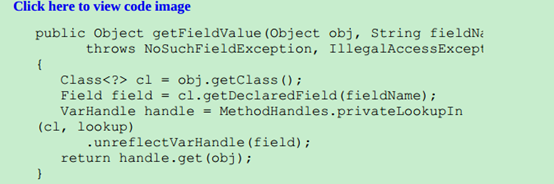

#### 5、a generic toString （一个泛用toString()方法）

- 通过反射实现通用的toString 还需要递归调用，知道都编程基本类型的toString()

- 主要步骤{
         1.  防止重复引用的对象 ，要加集合记录 (防止无限重复栈溢出)
         2.  判断为null
         3.  判断是否字符串
         4.  判断是Array 还是其他对象
         5.  判断是否基本类型
         6.  判断是否有父类，父类私有属性需要循环向上找

  }

#### 6、generic Array(根据指定类型创建数组)

- 如何定义一个相同类型的数组（感觉数组是java中底层用的最多的数据接够）

  通过java.lang.reflect.Array 动态创建数组 (获取一个新长度的数组)

  关键是要能返回一个相同类型的数据 ，就是定义一个类型相同的数组(数组用什么定义就是什么类型，就是强转后也不能接受非定义类型的实例)

- 实现方式：{
         1. First, get the class object of a.
      2. Confirm that it is indeed an array.
      3. Use the getComponentType method of the Class class (which is
    defined only for class objects that represent arrays) to find the right type
    for the array.

  }

- 使用结果： 参数接受是Object ，就可以兼容基本变量的数组，返回对应类型的数组

#### 7、运行任意的方法和构造函数

- Java中代替（代替方法指针 c c++ ）使用interface 和lambda表达来实现运行方法，所以获取任意方法运行需要不一样的解决方案
- 用反射是实现 Method 的invoke 方法
         1. `Object invoke(Object obj, Object... args)` 嗯就这么不想写Object[] 吗前面隐式参数 .  后面显式参数  (静态方法填     null 就可以了)
      2. `invoke` 返回的基本类型都要装箱封装 返回 （所以只能用封装类型进行强制）
      3. `class.getMethod(方法名)`
      4. `Method getMethod(String name, Class... parameterTypes)` 还得加上参数类型不容易啊

- 用反射获取实例

  `Constructor getConstructor(Class... parameterTypes)` 直接上类型 然后`newInstance（Clas.. parameterTypes)`

  基本类型参数不能用封装类型的class 否则找不到方法

  反射获取方法是低效且易出错的（那我学着干嘛的） （一般情况下接口和lambda表达式就够了）

  用这种的以前都是回调（就是具体方法可以传入，不过aop 代理需要这种反射，回调也是代理的一种模式）

### 9、使用继承编程的特点

{
       1. Place common operations and fields in the superclass.
    2. Don’t use protected fields （子类可以有很多，且同包的其他类也可以访问）
    可以用在方法上
    3. Use inheritance to model the “is–a” relationship. （不要多余）
    4. Don’t use inheritance unless all inherited methods make sense.
  （不需要的方法不要继承，跟多是避免多余的方法产生的额外影响）
    5. Don’t change the expected behavior when you override a method. （重写也是做相同的事）
    6. Use polymorphism, not type information （why 具体类型不是挺好的吗）{
      ``if (x is of type 1)`
      `action1(x);`
      `else if (x is of type 2)`
      `action2(x);`
      `x.action();` 给jvm找活干`
  }
    7. Don’t overuse reflection. （错误只有运行时才能发现，但是很强大，看源码的时候打望打望呃）

}

### 10、java 实现面对对象的基础

- ***supports the fundamentals Javaof object-oriented programming: classes, inheritance, and polymorphism.***

## Interface、lambda、inner class

### 1、interface

#### 1、基本概念

- 描述需要做什么，没有具体实现，具体实现由实现类提供，一个类可以实现多个接口。 

- ex： Arrays 的sort 方法`public static <T> void sort(T[] a, Comparator<? superT> c)`  对`Comparacomble`接口的

  实现

- 接口所有的方法默认使用 public修饰 ，接口只有常量

  java8 可以在接口中实现部分方法（不能使用instance fields）有default和static 方法

#### 2、实现类的方法

   1.  You declare that your class intends to implement the given interface.
   2.  You supply definitions for all methods in the interface （全要加上隐藏的public 修饰词）

#### 3、第一个接口实例 Comparacomble 接口实例

- java 5的 Comparacomble<T> 是有泛型支持的， 不需要进行Object 强转了

  动不动就超多数字 的取值范围

- 一般compareTo 和equals 方法是兼容 的 结果一致的
  有趣的反例{
      ``BigDecimal. Consider x = new BigDecimal("1.0") and`
      `y = new BigDecimal("1.00"). Then x.equals(y) is`
      `false because the numbers differ in precision.But`
      `x.compareTo(y)` is zero.`
  }

#### 4、使用接口的原因

- java 是一种强类型的语言，调用方法是需要确定类中一定要有方法，不过实现接口，就证明一定有方法。

  实现接口能确保方法的实现。不会出现调用方法时候导致jvm 抛出异常

#### 5、继承类对父类接口方法的实现

- 泛型会沿用父类的泛型需要特别的处理（注意）例如比较接口

  子类需要重写父类 实现的接口 需要注意接口泛型的情况 如compareable<T> 这种接口,子类比较父类实例时 需要注意类型转换问题（父类无法转换成子类）

  如果只想子父类共用一个比较方法，就对父类的比较方法使用final 进行修饰

  在子类中实现一个新的比较方法，会引起多态不适配的问题，所以最好不要干

  {

  ​	1. 每次compare 的时候都进行类型判断，否则抛出类型转换出错误

  }

#### 6、接口和抽象类之间的区别

- java 中累的继承一个类，但是能实现多个接口，使用接口是避免多继承的代码复杂和低效

#### 7、static 和private 方法

- java8 运行 可以使用static/default 定义有实现的方法

  可以使用接口调用方法Path 接口 有啥好处呃 除了违法接口抽象的精神 但是统一了Collection/Collections（让一些工具类小时）

  无需新建个工具类提供静态方法，直接在接口中提供这些方法。

  java 9 添加了private 修饰的static / instance method 感觉接口承受了它不该承受的功能

#### 8、default method（接口默认实现方法）

- 由接口方法提供的默认实现

  //Iterator 接口 ，只读不需要实现remove方法 默认直接给你抛个错误

  `default void remove() { throw new UnsupportedOperationException`

  Collection （AbstractCollection） 中的 `isEmpty()` 方法，也是用的默认实现。

- 主要作用用于在接口演化 添加新的方法的时候 不用染旧实现实现新的方法

  Collection 添加了 Stream() 方法

  在已经稳定运行的接口中添加a nondefault method 是一个具有风险和麻烦的事情，当然还可以当个工具类使用

#### 9、解决 default method 冲突

- 默认方法和接口和实现类冲突时解决方法{
         1.  Superclasses win. If a superclass provides a concrete method, default methods with the same name and parameter types are simply ignored. （防止影响其他有实现的方法）
         2.  Interfaces clash. If an interface provides a default method, and another interface contains a method with the same name and parameter types (default or not), then you must resolve the conflict by overriding that method(接口冲突需要手动解决，方法签名相同随便选个实现下就可以了，单继承类不会出现，实现接口才会出现)

  }

  Object 里的方法由于 1 原则，是无法使用default 改变的，谁让它是顶级superclass呢

#### 10、Interface 用于回调

- java 中的interface 是java 实现回调的一种方式。

  回调是一种代理模式 （提供方法的具体实现）

  在知道需要调用指定方法，但不知道方法的具体实现的情况下，可以将方法（具体实现）作为参数进行传递。

  java 中是实现某个接口的实例 来实现回调的，调用传入接口实例的指定方法，获取具体实现。（lambda也会穿件class的）

  回调（目前理解） 将具体的实现方法作为参数传递，调用的方法会调用传入的具体方法参数，所以叫做回调

#### 11、interface 的一些使用 实例

- Comparator Interface

  比较器（接口的一个经典使用，和回调结合使用） `Arrays.sort(Object[],Comparator)`

  像这些就可以和lambda 一起使用

- 对象克隆(Cloneable) （标记接口,没有事项方法）

  分为深拷贝和浅拷贝

  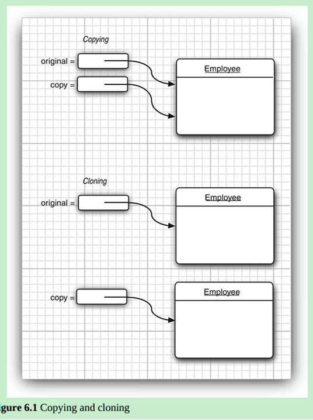

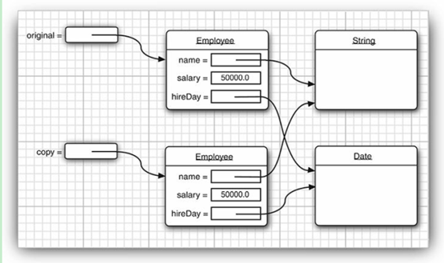

- 潜克隆使用（不推荐）

  1. cloneable 中没有任何方法和属性，只是表示可以clone ，方法来自Object，用于jvm 识别到底有没有
  2. 实现clone方法
      obj instanceof Cloneable 可以调用clone 方法
  	蛋疼的看https://www.zhihu.com/question/52490586/answer/130786763
  	原始的copy 对象实例关联一个新的 对象引用，对象还是一个（引用参数传递所使用的clone 方式）
      Object 中的clone 用native 修饰没有具体方法体 （只能成员变量值得进行复制， 如果还有引用变量就会复制相同的地址值）
      所以需要具体的实现来避免 潜克隆（防止复制对象和原对象共用相同的属性）
      如果属性引用属性不变化怎没有问题，否则需要重写clone 方法（不是用工具类吗）
  3.	是否重写克隆的选择 （使用工具类）
      {
             1. 默认clone 方法是否够用
          2. 对动态属性进行进行clone重写
          3. clone 方法是否能被访问
      
      }
  4.	Object中 clone 使用protect 修饰但不能直接被子类使用（机制诡异）（只能使用自己的方法克隆自身对象
  所以需要实现cloneable 接口调用默认方法，或者重定义（也要实现cloneable接口））
  5.	是否使用克隆：数组有克隆方法可潜克隆，jdk 克隆节本都是潜克隆，深克隆需要使用特别的工具类使用反射解决。

### 2、lambda表达式

#### 1、基本概念

- 一种可以展示跳过的代码块，在真实调用时在运行，所以lambda表达式是一段代码块，不是实例，是可以在方法运行时传入的代码块。

  传统回调都是丢一个匿名实例到方法里面的，方法通过匿名实例来运行一段代码块。（丢方法块也要对象）

  回调方法（根据用户具体方法需要实现特定的功能）替代部分需要通过 interface 实现的功能。

#### 2、语法

- `(String first, String second)-> first.length() - second.length()`

  所有的参数都要传递到这个代码块中，类型在已知的情况下可以忽略（有编译器解决）

  空参() 只有一个已知类型参数时可以省略() 

  返回值类型不能定义 由代码块内容决定

  ex：`public Timer(int delay, ActionListener listener)` 

  第二个参数就可以用lambda 表达式，而非实例（用于传方法块的实例）

#### 3、Function接口

- function接口的特点{

  1.	 一个接口只有一个抽象方法的实例被使用时就可以使用lambda表达式提供方法实现，这些接口被叫做function interface
  2.	 lambda表达式可以直接作为参数传递到需要这些接口实例的方法中
  3.	 lambda表达式可以使用接口接受 ，没有特别function类型
  4.	 lambda 表达式不可以分配给object
  5.	 lambda 表达式后台调用时都直接调用唯一方法并传入参数。

  }

- BiFunction<T, U, R> 可以用于接受一部分表达式

  回调方法，是有一部分公共方法，但还有一部分具体细节需要提供。 一般lambda里面的泛型会规定请求和返回类型。

#### 4 、lib中的一些function 接口（基本够用）

- Supplier<T> ，接受这个接口的方法，可以返回T实例，T可以使空参亦可以是有参，可以用于强迫个初始值等

  （） -> 获取的初始值是延迟的只有需要才会加载，延迟加载这是

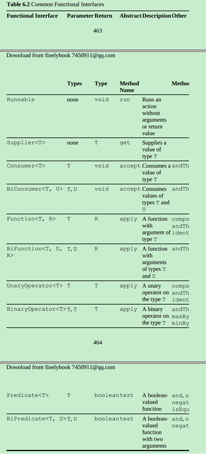

#### 5、method reference

- 类名::方法名 使用这个传递method reference

  可以吧method reference 作为参数接受的都是接受的Function interface，method reference 在调用接口方法的时候获得参数，并确定返回值。

- 作用：`var timer = new Timer(1000, System.out::println)` 只需要打印时间可以直接传方法

  `System.out::println` 

  让编译器去实现一个实例 actionPerformed(ActionEvent e) 调用 System.out.println(e)

  本质(感觉像一种语法糖)

- 注意：本质不是对象{
      Like a lambda expression, a method reference is not an object. It
      gives rise to an object when assigned to a variable whose type is a
      functional interface. （*是jvm调用方法时才变成实例的，但是lambda相关的类在编译后就产生了*）
  }

- 例子：`Runnable task = System.out::println`的抽象方法没有参数，所以只会打一个换行

  不过是会开一个新线程。

  `Arrays.sort(strings, String::compareToIgnoreCase)` 

  这两本质参数接受的都是接口

- :: 的使用类型{

  1. object::instanceMethod

  2. Class::instanceMethod

  3. Class::staticMethod

  }

  1. 中和lambda表带是等价 （x）-> {}

  2. 需要要将隐式参数传入  (x,y) -> {}

  3. 所有参数传入静态方法

  例子：list.removeIf(Objects::isNull); 简化书写

  可以用this super  只带当前实例，和父实例的方法

  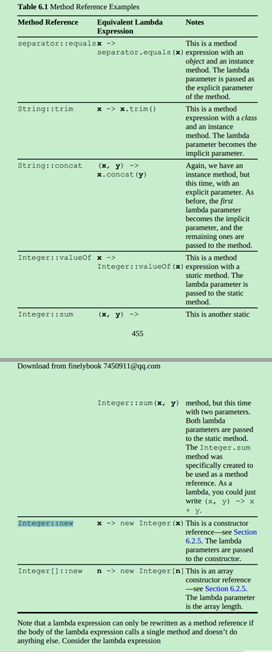

#### 6、Constructor References

- new Object()[]     

  应用数组不能直接指定长度可以使用 Objeect::new 来指定

  Person[] people = stream.toArray(Person[]::new); 直接将Object类型指定位指定类型

  将需要创建的实例传递个方法，不需要通过反射获取创建

#### 7、Lambda中的变量作用域

- Lambda表达式的构成
  {

  1. A block of code
  2. Parameters
  3. Values for the free variables—that is, the variables that are not
  parameters and not defined inside the code

  }

- 传入lambda代码块的值是复制进去的，因为lambda要作为参数传递，所以只能复制值

  所以需要保证lambda传入的值（String等无法改变的引用类型）是不会变化的，防止并发问题，基本类型是可变的所以无法使用。

  lambda 中获取抓取的值都是final修饰的

- lambda 中this关联的是创建lambda的对象，所以lambda 不能有和该方法中变量名相同的变量final修饰的

  使用应用变量的时候，会是lambda表达式存在并发问题，需要调用方法自己控制（ArrayList 是线程不安全的 Vector 是线程安全的）

#### 8、如何使用lambda 表达式

- ***Lambda运行的关键是延迟运行，只有方法被调用时，才会运行lambda的代码块***。（提供一个延迟运行的代码块）

- 使用lambda的理由{

  1. 在一个单独的线程运行代码
  2. 多次运行方法
  3. 运行代码在算法恰当的时间（比如比较算法
  4. 触发的时候才运行代码
  5. 只有需要时才运行的代码

  }

- 一些是用lambda表达式给参数包含function 接口的方法例子

  1. 多线程的

     ```java
       public static void repeat(int n, Runnable action)
         {
             for (int i = 0; i < n; i++) action.run();
         }
         repeat(10,() -> System.out.println("多线程运行中"));
     ```

     ​    调用action.run() 时开始运行lambda表达式

     ​    调用action.run() 时开始运行lambda表达式

  2. 操作int的

     ```java
        public static void repeat(int n, IntConsumer action)
       	{
     ​    	for (int i = 0; i < n; i++) action.accept(i);
     ​    }
     ​	repeat(10, i -> System.out.println("Countdown: " + (9 -i)));
     ```

     ​	使用IntConsumer 会比  Consumer<Integer> 有更高效率

     ​	使用IntConsumer 会比  Consumer<Integer> 有更高效率

- Function 接口有很多方法用于拼接lambda表达式（都是些金泰方法）

  `Predicate.isEqual(a).or( Predicate.isEqual(b)).test(x)`  // test的时候进行调用等效 x -> a.equals(x) || b.equals(x)；

- 自定义函数接口可以加上@FunctionalInterface
  编译有两个以上抽象方法会报错，javadoc 会进行标明

#### 9、Comparators (深入了解)

- `Comparator.comparing(Person::getName))` 根据 根据姓名获取lambda表达式

- ```java
  public static <T, U extends Comparable<? super U>> Comparator<T> comparing(	
  Function<? super T, ? extends U> keyExtractor)
  {
  	Objects.requireNonNull(keyExtractor);
  	return (Comparator<T> & Serializable)
  	(c1, c2) -> keyExtractor.apply(c1).compareTo(keyExtractor.apply(c2));
  }
  ```

  可以通过Comparator.comparing(Person::getName)),调用直接传递方法应用 返回的是lambda表达式

- 使用 thenComparing 可以继续加排序条件 更多的lambda表达式

  `Arrays.sort(people,Comparator.comparing(Person::getLastName).thenComparing(Person::getFirstName));`

#### 10、注意事项

- lambda expressions 和 method references 都不是对象，在They are always
  turned into instances of functional interfaces

### 3、inner class （内部类）

#### 1、基本概念

- 定义在其他类内部的类，不用public修饰的类。

  使用原因{

  1. 可以对同包下的类隐藏

  2. 可以使用所在类的private属性

  }

  以前一般是写匿名内部类，到那时内部类品种比想的多（虽然过时了）。

#### 2、内部类获取外部类属性

- 内部类实例创建后会关联外部类实例，从而适用外部类的属性；相当于有个outer属性（在内部类构造的时候进行）

  调用时使用外部引用直接调用外部属性（其实还是会调用访问方法）
  
  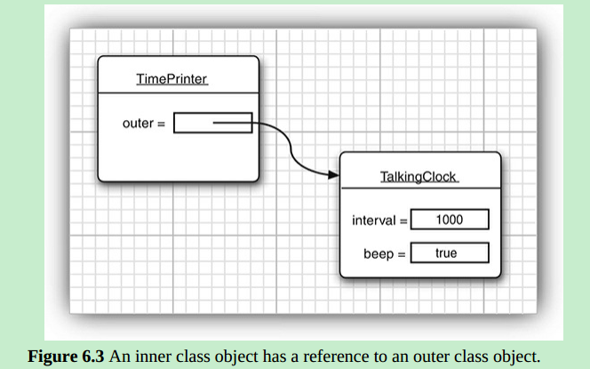

#### 3、 内部类的语法

- 新建内部类的语法

  `outerObject.new InnerClass(construction parameters)`

  ex：    `ActionListener listener = this.new TimePrinter();`

  内部类中的field 都是 final 修饰的，但是不能有static method（静态内部类可以）

#### 4、内部类的编译原理

- **首先强调内部类都应该被private 修饰，否则都是会被同包使用**

  **修饰词不能省，否则编译器不需要做操作**

- 编译器在编译内部类的时候会将内部类解析成一个public 类，并生成独立的class文件

  可以使用下面命令查看编译后的类的属性

  `javap -private innerClass.TalkingClock$TimePrinter`  可以看对应class文件的信息	

  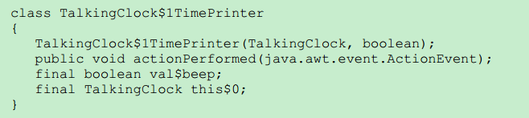

- 普通类是先内部类最大的区别是没有权限访问外部类的私有属性（血的教训没有修饰词，同包访问的时候，不会生成access方法）

  `static int access$000(char06.InnerClass)` 这是一歌默认权限的方法，所以同包也是可以访问的有一定风险。

  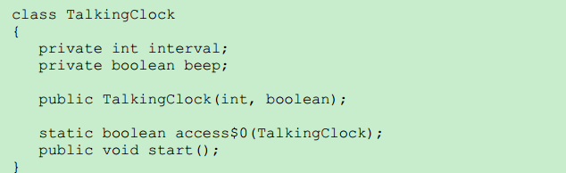

- 私有的内部类在生成够早类时会生成两个构造函数，原构造被私有只能通多第二个构造，

  {

  ​       private char06.InnerClass$inner(char06.InnerClass);

  ​       char06.InnerClass$inner(char06.InnerClass, char06.InnerClass$1);（第二个参数填null）

  }

#### 5、Local inner class （局部内部类）

- 直接在方法代码块中声明，本地内部类的作用域只用方法块中，所以除了代码块无法访问（私有其实强行访问也是可以的）

  局部内部类可以访问局部变量，方法中的。

- 匿名内部类在编译时会将需要使用的局部变量作为instance feild 放入构造器，用final修饰，该属性在构造器中被初始化。

#### 6、匿名内部类

- 目前已被lambda完全取代（当然匿名内部类可以继承类，和实现多个几口方法，lambda只有一个，但是方法传递一般就一个）

  语法

  ```java
  new SuperType(construction parameters)  // superType 可以是类，被匿名类进行继承
  {
  	inner class methods and data
  }
  ```

- 匿名内部类语法上没有构造函数，构造参数直接传入supertype 中

  invite(new ArrayList<String>() {{ add("Harry");add("Tony"); }}) 

  可以使用内名内部类的静态代码块进行初始化，**不过获取的类实例是子类实例**

- 匿名类实例导致的问题

  在进行equals（）判断是会出错不推荐。

  List.of("Harry", "Tony") 哟还有这个 方法啊

- 特殊用法{

  new Object(){}.getClass().getEnclosingClass() 获取static方法快的类名（没啥用啊）            }

#### 7、静态内部类

- 将一个类隐藏到一个类中，但和这个类的引用无关直接提供静态代码

  该类里面方法默认 public static ，可以在构造是赋值，提供静态方法访问多个值，适用于返回多个值，但有不同的作用（削了 泛型以后可以用泛型做）。

### 4、服务加载器（Service loaders）

#### 1、概念

- ServiceLoader class 用于加载符合某个接口的某种服务（该接口或者父类具有多种实现）。

#### 2、使用过程

- {

  ​	需要在META-INF/services 对应接口全类名的文件，里面有实现类的名称（全类名）

  ​	public static ServiceLoader<Cipher> cipherLoader = ServiceLoader.load(Cipher.class);

  ​    返回的该接口实现类实例迭代器，可以loop 获取需要的实例

  ​    可以转换为stream流用filter过滤获取所需要的实现类 （9 添加的方法）	

  }
  
  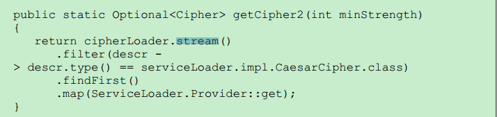

### 5、Proxies（需要明白）

#### 1、基本概念

- 代理用于程序运行时，你不知道哪些接口实例需要怎样具体方法使用。

  对实现一个系列接口的实例进行功能增强、或者补全。

#### 2、代理运行原理

- 代理是在运行时动态的生成代理，来解决编写是不知道接口的具体实现方式。（使用代理类处理接口是因为接口无法直接获取实例）

- 使用代理的条件{
         1. All methods required by the specified interfaces （所有的方法被特殊的接口需要）
      2. All methods defined in the Object class(所有的方法定义在Object 类中

  }

- 一个类需要被代理需要实现InvocationHandler接口并实现invoke方法

  `Object invoke(Object proxy, Method method, Object[] args)` 只要返回个Object对象就好了，并不一定要运行原始调用方法。Method.invoke(实例，参数)

  继承的invocation handler

  继承的invocationHandler 接口 的类的invoke，是代理类调用方法，代理类只有一个方法，就是调用该invoke方法。

- 创建代理类使用Proxy.newProxyInstance 来获取代理实例
  创建java中代理类所需的参数{
         1. a class Loader 类加载器
      2. an Array of Class Objects 需要被实现的一个或者多个接口
      3. an invocation handler

  }

- 创建代理类的目的{

  1. 路由调用远程服务的方法
  2. Associating user interface events with actions in a running program
  3. Tracing method calls for debugging purposes 追踪方法调用

  }

- **代理类的工作方法(重要)**

  创建代理类和实例后Method和参数都会传递个代理类中，代理类实例都是运行时实时生成的。

  代理类会实现和原类相同的接口方法，在调用该方法的时候，代理类是直接调用invocation handler 的invoke()方法 由原方法决定具体处理过程。

  ex：一个示踪代理 Integer 实现了Comparable接口，想追踪，Arrays.binarySearch(Objects[],key) 中调用compareTo方法 （参考代码）

  可以将Integer[] 替换成代理实例数组，看看到底调用了几次compareTo方法。

- ***注意 Proxey.newInstance()传入的三个参数 类加载器、代理的接口class，invocation handler***。

#### 3、代理类中的属性

- 特点{

  	1. 代理类是一个运行时创建的普通类，和普通类是一样的。
   	2. 代理类是直接代理的接口代表的方法，所以请求参数和返回值和接口是一致的，lambda表达式也是这样的
   	3. 代理类中只有一个instance field 是invocation handler 因此运行时所有需要的属性都需要放入invocation handler 类中。
   	4. 代理类中的`toString, equals, and hashCode` 被重写为调用invocation handler中的方法。
   	5. 代理类的名称是不确定的，根据运行环境确定。
   	6. 对于一个明确classLoader 和有序的接口集合，只会产生一个代理类，不同的invocation handler 对应不同的实例，可以使用`getProxyClass` 获取代理类信息。
   	7. 代理类运行的本质{
           constructs a new instance of the proxy class that implements the given
           interfaces. All methods call the invoke method of the given handler
           object.
       }

  }

## Exceptions, Assertions, andLogging

### 1、处理异常的最低标准

- 1. Notify the user of an error;
  2. Save all work and Allow users to gracefully exit the program

### 2、处理异常

#### 1、处理异常的两种方式

- {

  ​	1. Return to a safe state and enable the user to execute other commands;

  ​	2. Allow the user to save all work and terminate the program gracefully

  }

#### 2、异常存在的场景

- {

  1. 用户输入错误，必然发生的异常。（需要进行校验）
  2. 硬件错误
  3. 物理限制
  4. 代码错误

  }

  Java使用Exception体系来处理异常

#### 3、Java中Exceptions的分类

- 所有的异常对象都是throwable的实例

  Throwable向下的继承体系{
         1. Error反应java运行环境中本质错误和资源枯竭
      2. Exception 分为RuntimeException 和 IOException

  }

- RuntimeException的使用原则
  属于RuntimeException{
      A bad cast
      An out-of-bounds array access
      A null pointer access
  }
  不属于的{
      Trying to read past the end of a file
      Trying to open a file that doesn’t exist
      Trying to find a Class object for a string that does not denote an
      existing class
  }

  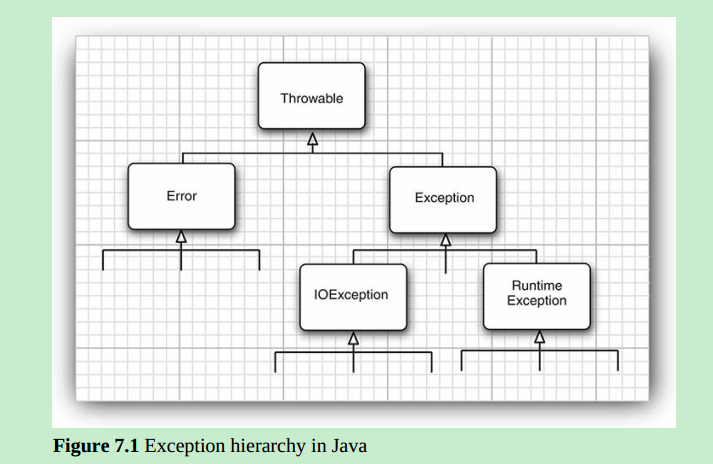
  
- Checked 和 unchecked 方法

  编译器编译时是否检查

  除了Error 和RuntimeException 是unchecked异常，其他都是checked异常。

#### 4、异常的声明

- Java通过throw Exception抛出无法处理的异常抛出之后都需要对应的Exception
  handler 处理，对于checked Exception 要么处理要么 抛出给调用者。

- 注意：
  1. 子类抛出的异常范围不能超过父类，当父类不抛出异常的时候，子类需要自己处理异常（多态的原因）。
  2. Java 的throws 是编译时校验的，没有throws 说明不能抛出任何复checked Exception
  3. 异常常类的创建只需要继承Exception及其子类

#### 5、捕获异常

- 如何捕获
  异常不捕获的化会直接导致程序的崩溃，并给出异常追踪链
  最简单的语法

  ```java
  try{
      code
  }catch (ExceptionType e){
      handler for this type
  }
  ```

-  运行方式 try中代码发生异常时，没有发生则不运行catch{

  1. 跳过try中的剩余代码

  2. 运行catch中的处理方法

  }

- 如果遇到超过catch限定的异常类型，也会直接报出错误
  抛出异常和catch异常的选择{
      捕获所有自己知道怎么解决的异常
      抛出所有自己不知道怎么解决的异常。
      将异常传递个足以解决的handler中，而不是中途消除它。
  }

- 处理多类型的异常

  抓取多种异常，对不同的异常进行不同的处理方式

  ```java
  try{
      code that might throw exceptions
  }catch (FileNotFoundException e){
      emergency action for missing files
  }catch (UnknownHostException e){
      emergency action for unknown hosts
  }
  ```

​        抓取顺序由小到大
​        在进行我中类型的异常抓取的时候，e是隐藏final的，过程中无法对e重新分配值
​        使用多类型异常捕获会生成一个代码块共用the shared catch clause 假装提高效率

- 重新抛出

  重新抛出，对异常重新包装，展示调用者所需的异常信息

  ```java
  try{
      access the database
  }catch (SQLException e){
      throw new ServletException("database error: " + e.getMessage());
  }
  ```

  还可以对新抛出的异常进行初始化e.initCause(original); 保存原异常信息通过getCause()来获取引发原因
  这种异常封装在丢出高级异常的同时不会损失异常细节
  当遇到不可抛出的checked Exception 可以封装成RuntimeExcetption (骚操作)
  java7 有bug这种重新抛出的异常被认为可能是任何异常。

- the finally clause(用于清理资源)

  用于清理该方法占用的本地资源。 防止你在try中写一遍，catch中写一遍。finally 中的代码无论如何都会执行

  ```java
  try{
      try{
          code that might throw exceptions
      }finally{
          in.close();
      }
  }catch (IOException e){
      show error message
  }
  ```

  在外层进行catch 不仅能够处理异常，还能包含finally 中的异常信息（鬼才写法）
  注意 finally 中不要写return finally 会在方法实际return前调用，finally中的return会替代方法中的return
  finally中的语句值用于清理资源，不要有改变控制流的语句(return, throw,break, continue)

- The try-with-Resources Statement（使用资源的try方法处理）

  用于替换finally的功能，需要实现AutoCloseable 接口用于关闭资源

  语法

  ```java
  try (Resource res = . . .){ // 语法会变得非常的简洁
      work with res
  }
  ```

  自动关闭资源，java9 中可以外部声明变量

  但关闭遇到异常时，该写法会把rethrown 并通过addSuppressed 添加到原异常中

  [^注意]:A try-with-resources statement can itself have catch clauses and even a finally clause. These are executed after closing the resources.

- 分析栈示踪元素

  A stack trace is a listing of all pending method calls at a particular point in the execution of a program.(反应java栈中方法的运行过程)

   使用Throwable.printStackTrace() 来打印这个列表

  java9中获取方法{

  ​    `StackWalker walker = StackWalker.getInstance();`
  ​    `walker.forEach(frame -> analyze frame)`
  ​    获取出来的是StackWalker.StackFrame 对象
  ​    `walker.walk(stream -> process stream)` 包含详细信息

  }

#### 6、异常的使用建议

- {	

  1. 异常处理不应当被用于替代一个简单的测试（使用try catch 会比简单判断消耗跟多的性能，只在预期之外的地方使用异常）
  2. 不要微观管理异常，将需要处理的一整个task放入 try block中，将普通处理和异常处理分开。
  3. 利用好异常的继承体系。{
      寻找适当的异常抛出，选取runtimeException的子类或者自建类
      对异常catch 要细化处理
      checked Exception过于繁重不应该用它抛出逻辑错误，反射的lib 就这么干了，抛出不会发生的异常
      将一种异常转换为另一种异常方便顶层调用理解
  }
  4. 不要消除异常 不想抛出异常的时候，在消除需要谨慎，并采取适当的方式来处理
  5. 当察觉到有异常出现的情况，需要进行相应的处理，而不是不做处理。{
      选取是抛出异常，还是异常返回一个特定值。如果不加异常，需要加上相应的判断
      但是过多的判断也很麻烦呃。
  }
  6. 传播的异常不应当是一个虚假的标识{ （我还是不太希望进行传播） 不该都是运行异常吗
      比起消除异常，可以吧异常报个顶级调用者处理。
      嗯我还是转成runtimeException 子类，不想传播啊
  }

  }

### 3、断言（Assertions）

#### 1、断言概念

- 用于防止编程是的错误，这些错误都需要被避免

  在确定所使用的值都满足的情况下只是测试需要考虑。
  因此断言允许你测试的时候进行检查，在生产是自动移除
  java中单元的语法（关键词 assert）{
      不满足条件报错（差点理解反了）
      assert condition; （运行出错返回一个AssertionError）
      assert condition : expression; （返回AssertionError的同时可以添加错误信息）
  }
  AssertionError 是不保存错误信息的都在expression中，java鼓励解决断言的错误，断言用来调试错误
  ex： assert x >= 0 : x;

#### 2、 断言的启用和关闭

- 断言默认是关闭的，需要使用java -enableassertions 或者-ea 命令调用（不需要重新编译旧可以使用）

  classLoader 在断言未开启时去除断言代码，不影响性能
  还可以指定某个文件或者文件夹开启断言
  `java -ea:MyClass -ea:com.mycompany.mylib MyApp`
  可以是使用 -da 关闭特别累的断言

  一些用不上的断言开关{

  ​    有些类不使用类加载器可以是用 -ea -da 调控
  ​    对于system classes 需要使用enablesystemassertions/ -esa 来开启断言
  ​    还可以通过classLoader 来控制断言的开关

  }

#### 3、使用断言进行参数校验

- java中处理异常的三种方式
  {
      Throwing an exception
      Logging
      Using assertions
  }
  选择断言的原因{
      1、断言意味着致命、不可恢复的错误（需要修复）
      2、断言只在开发和测试的时候进行检查
  }

  断言值应该程序本质错误在测试的时候
  值有在参数明确限定其范围的时候加断言进行测试
  读参数的断言叫做 precondtion 使用断言方法的调用会变的不可预期

#### 4、使用断言的情况

- 可以用断言谢谢注释吧，没啥用

  断言战术工具， 日志战略攻略工具（基本都用日志了）

### 4、Logging(日志，java自带的)

#### 1、使用日志的好处

1. 可以轻松的过滤所有的日志，或者指定级别下的日志，也可以轻松是它们重新显示。
2. 过滤日志非常容易，所以将日志代码留在代码中只会花费一个极小代价
3. 日志记录可以只此昂不同的handler用于不同的展示形式。
4. logger 和handler 可以过滤文件，可以使用任何的自定义标准过滤一部分日志内容
5. 日志记录可以格式化为不同格式的文件，如text. xml等。
6. 软件可以使用多种loggers 使用包名作为分隔
7. 日志配置可以被配置文件控制。

#### 2、默认日志

- 学默认的日志系统，和log4j是可以无缝切换的，真的是jdk使用者。
  java9 中有封开的轻量日志系统来调用不同的日志系统。

#### 3、全局日志

- 使用全局日志
  `Logger.getGlobal().info()` （会输出固定的日志格式）
  `Logger.getGlobal().setLevel(Level.OFF);` 在main方法使用所有的日志都会被禁用

#### 4、自定义Logger

- 自定义方式

  `private static final Logger myLogger = Logger.getLogger("com.mycompany.myapp")`
  logger 不应该被gc回收所以使用 static显示
  logger 和包名一样是继承的，且**logger parents 和 children 是共用属性的，所以对父类的日志级别会影响子类**

- java默认有七种默认级别{
      SEVERE
      WARNING
      INFO
      CONFIG
      FINE
      FINER
      FINEST  （默认是打印前3总日志，咋和我常见的级别不一致呢）
  }

  `logger.setLevel(Level.FINE)` Level.ALL Level.OFF 来控制logger 输出级别
  当你改变了 logging level ，也需要改变日志handler处理的日志级别（默认也是info）

- 一部分冷门api

  1. 如果虚拟机优化了运行可以使用void logp(Level l, String className, String methodName,String message)获取精确的位置。
  2. 对某各类中某个方法进行示踪的api{ （打印的是示踪格式的文本，打印的就是传入的参数）
         void entering(String className, String methodName)
         void entering(String className, String methodName, Object param)
         void entering(String className, String methodName, Object[] params)
         void exiting(String className, String methodName)
         void exiting(String className, String methodName, Object re
     } （These calls generate log records of level FINER that start with the strings ENTRY and RETURN.）

  3. 两种打印异常的方法

     {
         void throwing(String className, String methodName,Throwable t) （不需要try catch）
         try catch 在catch中打印 （有点意思）
     }

#### 5、改变日志管理配置

- 默认配置地址{
      conf/logging.properties
      jre/lib/logging.properties java9
      java -Djava.util.logging.config.file=configFile MainClass (自定义配置位置)
  }

  可以使用 日志名+.level=[level] 等其他属性值改变日志相关配置

  一些可用配置
  
  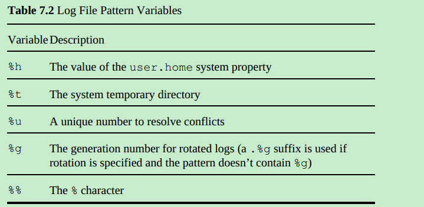
  
  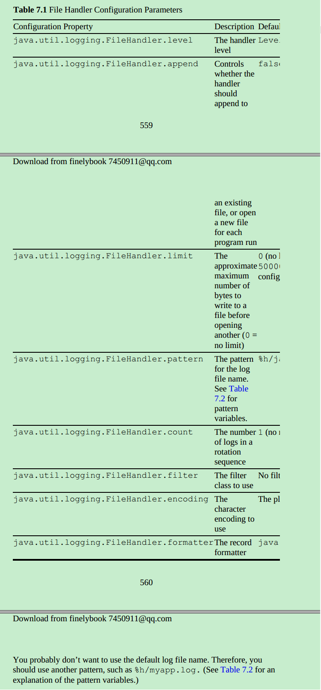
  
- java 日志管理是在main方法之前初始化（很有道理）{
      在main方法中初始化日志配置，需要刷新原有配置
      `System.setProperty("java.util.logging.config.file", file)`
      `LogManager.getLogManager().readConfiguration()；`（刷新）
      java9 可以`LogManager.getLogManager().updateConfiguration(mapper)`
  }

- java9 中修改配置的方式{
      mapper 是一个Function<String,BiFunction<String,String,String>>. 这泛型有方法参数和返回值
      使用结合schema来管理旧配置和新配置
      key -> ((oldValue, newValue) -> newValue == null ?oldValue : newValue)
  }

- 可以运行中修改

  使用jconsole在运行中改变日志级别
  参考www.oracle.com/technetwork/articles/java/jconsole-1564139.html#LoggingControl
  我都在学习什么鬼东西

#### 6、日志的本地化

- 根据不同地区习惯语言，打出不同格式的日志， 可以通过绑定名字、占位打出不同地域的日志格式
  java9 可以绑定对象而不是名字（一个个属性）

#### 7、日志handler

- 用于处理Logger传递的record

- 默认handler 和新建handler

  默认的logger 发到 父handler （with name ""） 然后调用ConsoleHandler
  将内容放到System.err的stream中。

  也可以新建个添加到Logger{

  ​    `var handler = new ConsoleHandler();`
  ​    `handler.setLevel(Level.FINE);`
  ​    `logger.addHandler(handler);`

  ​	默认的日志会发送个自己的handler 和父类的handler 为了不打印两遍
  ​	 可以设置`logger.setUseParentHandlers(false);`

  }

- 内置的其他handler

  1. FileHandleer {
         默认javan.log 发入用户所在文件夹 （默认格式是xml呃 ，可以之定义呃）
         有很多属性可以使用，命名、大小，新建删除规则
     }
  2. Sockethandler (将record 发给特别的host port)

- 自定义handler

  通过继承Handler 或者StreamHandler 可以实现自定义handler
  自定义一个将record 展示在窗口的继承 streamHandler 使用swing 输出窗口（还挺麻烦的）
  参考代码 需要重新定义 publish flush close 方法

#### 8、过滤器（filter）

- 默认情况下根据日志级别进行过滤，也可以填加可选过滤器进行额外过滤

  格局内容进行一部分过滤，其实还应有意思的

  自定义handler{

     1. 实现Filter 接口
  2. 实现boolean isLoggable(LogRecord record) 方法
  3. 使用时每次最多只可以有一个filter

  }

#### 9、格式化（Formatters）

- 用于是用自定义的格式进行日志输出
  只要实现Formatter class 重写format 方法
  常用方法{
      调用formatMessage 可以进行部分本地化工作
      String getHead(Handler h) 这两是格式头也可以重写
      String getTail(Handler h)
      setFormatter 将Formatter 设置如Loggeer中
  }

#### 10、使用日志的建议

- 我个人认为认为**Logger、Handeler、Filter、Formatter** 这些构成就行了

- 使用选择{

  1. 对于简单的项目，使用一个和main方法所在package相同的Logger就可以了，可以写成静态在任何地方调用。
  2. 比起改变日志的默认配置（比较involved），应该在main方法中安装一个更合理的logger
  替代原来的{
      替代默认的 ，需要判断默认有没有值（不要用看看就好）
      `Logger.getLogger("").setLevel(Level.ALL);`
      `final int LOG_ROTATION_COUNT = 10;`
      `var handler = new FileHandler("%h/myapp.log", 0, LOG_ROTAT`
      `Logger.getLogger("").addHandler(handler);`
     }
  3. 当准备log关键文本的时候，把这些日志设为INFO, WARNING, and SEVERE呈现给用户，
  用fine来打印需要给编程人员看的日志，别用sout了全用日志了，反正默认也打控制台。

  }

### 5、debugging tips(调试建议)

- 在进行debug前需要尝试的一些方法{

  1. 可以打印出需要调试变量值，一般都有toString（）方法
  2. 使用分离的main方法，进行隔离的单元测试，用于测试类中的方法（实际编程只能用在一部分地方）
  3. 相比直接debug 可以使用main junit 测试方法直接运行，并答应出相关变量（切得比较的小）
  4. 代理日志类，用匿名类来代替原类调用原方法的同时打印日志，和Proxy.newProxyInstance 不同，是可以对类继承的（匿名内部类）
  可以用于追踪方法调用，具有更大的适用性，比之前的Proxy.newProxyInstance的代理。这种代理类是编译的时候就生成的。
  5. 可以获取stack trace 特别是异常都是会包含该信息，也可以Thread.dumpStack() 获取
  6. stack trace 正常是输出到System.err 中，所以需要制定相应的输出流. 
  7. 将System.out 和System.err的内容输出到一个文件中{
            `java MyProgram 1> errors.txt 2>&1` 总有中熟悉的感觉 
  }
  8. 将unchecked de 方法输出到System.err 对终端用户不友好，所以可以将这些异常放到单独的文件（有毒吧）
  9. 可以使用 java -verbose 查看java虚拟机的类加载，用于诊断类路径问题。
  10. javac -Xlint sourceFiles可以知道编译准确的代码问题{
           `javac -Xlint:all,-fallthrough,-serial sourceFiles` 可以关闭部分代码报错
  }
  11. jvm为java程序提供监控和管理{
      允许安装jvm的代理获取 track memory consumption, thread usage, class loading, and so on 的信息。
      jconsole 就是官方提供的统计窗口，可以看jvm上运行的程序
      可以看www.oracle.com/technetwork/articles/java/jconsole-1564139.html 获取更多的信息（挺好看的）
  }
  12. Java Mission Control 是Oracle提供的一个监控器https://docs.oracle.com/javacomponents/index.html
  开发可以免费使用

  }

## Generic Programming (泛型编码)

### 1、概述

- Generic classes and methods have type parameters（确定实例化后是准确的类型）
  为其他使用者提供不会造成困惑的类和方法，通过限定类型。
  由于向前兼容的问题，java的泛型还是存在擦除机制，导致一部分功能限制。

### 2、使用泛型的原因

#### 1、作用

- 泛型编程意味着所写的代码可以被不同类型的objects进行复用

#### 2、类型参数的好处

- ex ArrayList 没有类型参数是持有Object 类型的，获取需要强转，插入没有类型校验
  使用type parameter 会标明集合锁持有的参数，编译器就可以检验插入的参数类型和直接获无需强转
  是代码更加的readable 和safe
  
  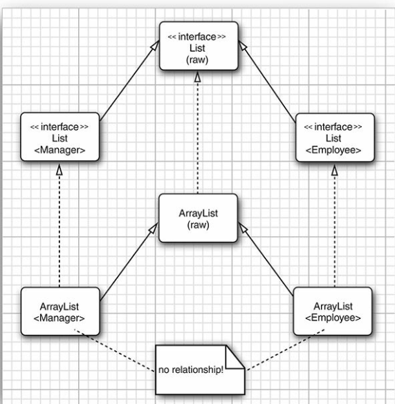

#### 3、使用泛型的原因

- 需要预期使用类的潜在未来（要不要提供泛型支持）
  值使用泛型存在问题举例{
      ArrayList.addAll(); 子集合和父集合 子集合不能添加父集合，父集合可以
      为了解决上述问题 发明了he wildcard type（通配符类型）然你写起方法更加灵活（有毒）
  }

- 使用泛型的三个程度{
         1. 只是简单使用泛型类
      2. 因为没有type Parameter造成的困难，让你自己开始写相关的方法
      3. 通配符相关的泛型，大部分被写jdk的写掉了（我们只要写一些接受一般类型的方法）

  }

### 3、自定义简单泛型类

- 语法：`public class Pair<T, U> { . . . }`
  该类型可以在整个类中被使用 一般用T ,U ,S 标识泛型 集合是E K V

  [^类比]:In other words, the generic class acts as a factory for ordinary classes.（有点意思）

### 4、定义泛型方法方法

- ```java
  class ArrayAlg{
      public static <T> T getMiddle(T... a){}
  }
  ```

  泛型方法在调用的时候不需要传入类型参数，类型由传入的参数确定。可以返回和传入值相同的类，不需要传对应的clas是对象，在不需要获取类型实例的情况下。

### 5、type parameter 类型变量的作用域

- 为了确保泛型在一定限制范围内，一般会限定继承类或者实现接口

- ex： 使用extends 限定接口和类

  \<T extends BoundingType\> 语法抱枕T是BoundingType 的subtype ,这两类型都可以是接口
  T extends Comparable & Serializable 多个通配符用 & 连接

- 泛型限定范围可以有多个接口或者类，在一个限定集合中，推荐用对象为第一优先（不过一般都是接口）

  编译后的类型为为第一限定条件，没有的化就是Object

### 6、泛型代码和虚拟机之间的关系

- 虚拟机中的类没有任何泛型，泛型的类编译以后可能可以在1.0 版本的虚拟机上运行，编译器会处理泛型问题。（就是没啥关系，和编译器相关）

#### 1、泛型变异的擦除机制

- 没有限制，T被Object替代 有限制，T extends 接口&类 会转换成第一个限制，并在调用其他限定成员时进行类型的转换

  擦除会使不同泛型的类吧共用初始类型的类{

  ```java
  Pair<T>  Pair<String> or Pair<LocalDate>  T -> Object
  Pair<T extends Comparable>  T - >Comparable
  ```

  ​    为了效率应该吧标记接口这种限制条件放后面，防止多次强转
  }

#### 2、泛型表达式的编译

- 调用泛型反法式会编译器会自动帮你类型转换{
      1、调用原方法，返回擦除替换的类型
      2、进性相应的强转
  }
  如果类中成员是public修饰直接调用也会自动进行cast（当然不该遇到）

#### 3、泛型方法的编译

- 方法翻译前后

  ```java
  public static <T extends Comparable> T min(T[] a)  // 编译前
  public static Comparable min(Comparable[] a)	  // 编译后
  ```

- 当类继承一个泛型类并使用具体翻新重写了父类方法的编译

  在保存子类中有具体类型的重写method，同时为了多态会新增一个重写父类擦除泛型后的相同method（变为擦除后的替换类型） 并调用子类有具体类型的重写方法。该新增方法叫做桥方法。

  这里多态的实现是通过调用桥方法，在调用具体子类方法实现的。

  ```java
  class DateInterval extends Pair<LocalDate> {
      public void setSecond(LocalDate second) { . . . } // 实际上的重写方法
      public void setSecond(Object second)	// 重写父类泛型擦除后的桥方法
  }
  ```

- 如果重写的方法不具有参数，会到导致方法签名

  ```java
  LocalDate getSecond() // defined in DateInterval
  Object getSecond() // overrides the method defined in Pair
  ```

  上述方法签名是一样的，但是编译器可以通过字节码让jvm识别，但是你不可以这样写。

- 桥方法的别的用处 （桥方法是继承多态的一个具体实现细节）

  在重写方法限定返回类型比父类小的时候也用到了

  ex：Cloneable 标记的类返回的是Object ，但是可以直接写成对应类型，中间就用了桥函数{
      Employee clone() // defined above
      Object clone()
  }

- 编译方法的注意点

  需要记住的要点{
         1. 虚拟中没有泛型，只有普通的类和方法
      2. 所有的泛型都会被对应的限制类型替换
      3. 桥方法被合成，用于实现多态。
      4. Casts are inserted as necessary to preserve type safety

  }

#### 4、泛型和旧代码之间的兼容

- 擦除机制保证了这种兼容性

  泛型的一个设计主要目的实现泛型代码和原有代码的互相操作

  旧代码使用泛型和返回泛型都会有warning警告，因为无法确定类型（例如set 和get）
  这也就抛个类型转换错误，反正以前也有，基本不会出现。（大部人写代码连这些功能都没有听过）
  @SuppressWarnings("unchecked") 关闭对应的编译器警告

### 6、限制和局限（Restrictions and Limitations）

- 大部分都是为了兼容性的擦除机制造成的

- 具体要点{	

  1. 基本类型不能做为类型参数（擦除后会变成对象类型）

  2. 运行时类型本质是原始类型（虚拟机中的运行没有泛型只能使用原始类型） 
      所以不能使用泛型来判断具体类型。因此使用getClass() 返回的是原始类型

    ```java
     Pair<String> stringPair = . . .;
     Pair<Employee> employeePair = . . .;
     if (stringPair.getClass() == employeePair.getClass()) //
     they are equal
    ```

  3. 不能够创建使用类型参数的数组，可以用通配符请转初始化，因为数组的初始化和擦除自己是冲突的
      数组创建不能使用擦除的原始类型进行初始化。 {
     `var table = (Pair<String>[]) new Pair<?>[10];` 
     所以相比用数组，可以是用数组集合进行初始化ArrayList: ArrayList<Pair<String>>
      }

  4. 可变参数可以，本质是个数组，虽然上面不允许直接实例化，这里只会抛出警告。但还是要注意编译器是否会报出类型转换错误

    ```java
    @SafeVarargs
    public static <T> void addAll(Collection<T> coll, T... ts) // 可以止痒写去除警告
    ```

    这样写会带来一些便捷，但也会导致数组ArrayStoreException ，但该参数一般只用于读取，保存会出错误

  5. 不能实例化类型参数 new T() 是不被允许的，因为擦除会变成限制类型，泛型实例获取示例{

      ```java
      public static <T> Pair<T> makePair(Supplier<T> constr){
      	return new Pair<>(constr.get(), constr.get());
      }
      Pair<String> p = Pair.makePair(String::new); // 获取对应类型的泛型实例。 T不能实例化
      ```

      可以通过java8 的构造相关获取实例 之前需要传入class 对象调用newInstance() 方法。

      }

  6. 不能使用泛型构造通用数组（数组创建时会限定类型每次保存时都会去确定类型），擦除类型后获得的数组和实际需要的是不一样的类型。{
     ex：

    ```java
     public static <T extends Comparable> T[] minmax(T... a){
     	var result = new Comparable[2]; // array of erased type
     	. . .
     	return (T[]) result; // compiles with warning
     }
     // 这里Comparable 数组不能转换成 其子类数组，会产生类型转换错误
     ArrayList 可已这样转换不出错是因为擦除变成Object[] 但不返回E[] 不进行cast不报错
     private E[] elements;
     public ArrayList() { elements = (E[]) new Object[10]; } // 这里E[] 已经擦除为Object[]，想不到吧 
    }
    ```

     想要获取可以返回的T[]实例的时候可以传入constructor expression ，或者使用反射

    }

  7. static contexts 中使用类型变量是无效的，因为泛型类会被擦除，所以不能具体类型调用相关方法，所以无效

  8. 不能抓取泛型的实例 Problem<T> extends Exception 不被允许 但是可以用来初始化异常格式T t，  t.initCause() 可以用这个初始化异常。

  9. 将checked 异常伪装成unchecked 异常 欺骗编译器，让编译通过。 这个比较诡异 不是
      T extends Throwable  可以接受RuntimeException在抛出，checked Excetion 变成 unchecked Exception

    ```java
    @SuppressWarnings("unchecked")
    static <T extends Throwable> void throwAs(Throwable t) throws T{
    	throw (T) t;
    }
    Task.<RuntimeException>throwAs(e); // 经过泛型以转换变成运行异常了
    ```

  10. 小心擦除后引起的冲突{
      比如equals() 方法会和泛型的冲突在才出后，需要重命名

      ```java
      public class Pair<T>{
          public boolean equals(T value) { return first.equals(value) && se
          . . .
      } // 这个由于没有具体类型，擦除后变成public boolean equals(Object value),和Object 中的冲突
      ```

      子类和父类都实现Comparable<T> 会因为使用两个相同签名，不同类型桥方法产生冲突。
      谁他妈这样写代码，我头有点痛。

  }

### 7、泛型的继承规则

- ​    使用泛型的类不会因为泛型的关系，产生任何关系。
  ​    和数组的继承之间转换相似，子类数组可以转换成父类数组，但不能放除了子类型外的元素。
  ​    泛型继承没有这个规则，为了防止错误，没有继承关系。（不能进行上述转换）

  ​    泛型可以转换为原始类型。这是为了兼容性，虽然失去了泛型的编译时检查。
  ​    泛型类可以向普通类一样继承使用。
  
  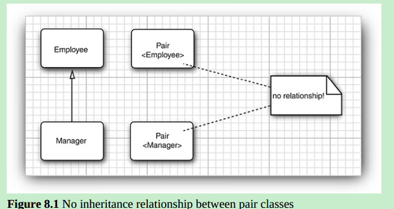

### 8、通配符类型（？）

#### 1、概念

- 使用通配符后类型参数会变成可变的（变成符合某个关系的类型集合），这个不能在类上使用。类还是只能有一种类型

  ex：Pair<? extends Employee>
  在使用 Pair<Employee> 的时候不能够吧Mannger 作为参数传进去，因为没用通配符会类型错误
  是用? extends Employee 就可以吧所有的子类都当做参数传入 而不是限定Employee 这一个类型

#### 2、通配符的子类限制（extend）

```java
public class Pair<T> {
	private T first;
	public T getFirst() {
		return this.first; 	//访问器
	}
	public void setFrist(T t) { // 构造器
		this.first = t;
	}
}
```

```java
public static void printBuddies(Pair<? extends Employee> p)
{
    Employee first = p.getFirst();	//可以调用泛型类的访问器
    Employee second = p.getSecond();
    System.out.println(first.getName() + " and " + second.getName() + " are buddies.");
}
printBuddies(new Pair<Manager>(ceo, cfo)); 
// 是用？ extends Employee 的时候虽然不知道读取的具体类型，但是读取的一定是Employee的类及其子类
// 但是赋值的时候你可以吧子类赋值给不相干的子类限制到导致类型检查错误，所以不能调用改变器
```


- 使用？extends class/interface 只能传入的的类型拥有公共的父类或者实现的子类，但是不知道具体类型

  随意可以使用 访问器获取相应的类型，但不可以使用改变其不知道具体的类型。
  
  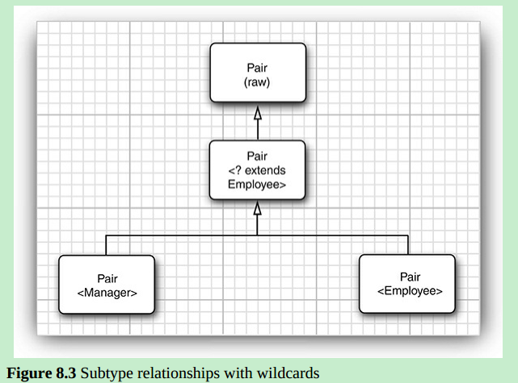

#### 3、通配符的父类限制

```java
public static void minmaxBonus(Manager[] a, Pair<? super Manager> result)
   {
      if (a.length == 0) return;
      Manager min = a[0];
      Manager max = a[0];
      for (int i = 1; i < a.length; i++)
      {
         if (min.getBonus() > a[i].getBonus()) min = a[i];
         if (max.getBonus() < a[i].getBonus()) max = a[i];
      }
      result.setFirst(min);
      result.setSecond(max);
   }
minmaxBonus(managers,new Pair<Employee>());
// 使用？ super Mannger 调用访问器放回的值都是父类可能是Object ，没有实际作用，所以不能调用访问器
// 但是为了如果是Mannager 类及其子类就可以满足所有父类改变器的要求，不会出现类型错误，所以可以使用改变器
```


- ? super Manager （只能使用Mannger 的父类）， 传入的类型只能是具体类或者接口的父类，

  这些父类可以访问改变器，但是不能访问构造器

  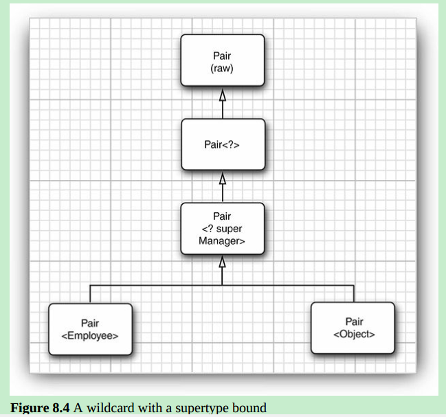

- 其实都是将可用范围限制在当前类及其子类中，使用extends获取值在这个范围，使用super可以改变的值在这个范围，是用通配符本质也是将泛型的类型的访问和改变限定在当前类及其子类范围中。使用super 是向上扩张，使用extend 是向下扩展，带来相应的不同限制。

  [参考]:<https://www.cnblogs.com/lucky_dai/p/5485421.html>

- 可以使用public static <T extends Comparable<? super T>> T min(T[]a) 来解决多个类

  其实可以简单解析{

   1. Comparable<? super T>  -> Comparable<F> F 是一个可变范围（T的当前类及其父类）

      这是一个Comparable<F> 此时被当做一个具体的类型，该类型需要实现Comparable接口，该类只会有一个

      一个接口只能实现一次。

  	2. T extends Comparable<F> 表示是F类型的一个子类或者当前类
   	3. 让我绕一下  T本身或者父类实现了Comparable 接口且 T 是该类的子类，一定是子类，只是语法用extends来写，有点晕 （写法本意就是 T及其父类有实现Comparable接口）

  }

  实现相同接口的冲突 这里使用的父类的接口 减少调用的时候类型转换错误，因为传递的是父类

  >For example, if you compute the minimum of a String array, then T is the type String, and String is a
  >subtype of Comparable<String>. But we run into a problem when processing an array of LocalDate objects. As it happens, LocalDate implements ChronoLocalDate, and ChronoLocalDate extends
  >Comparable<ChronoLocalDate>. Thus, LocalDate implements Comparable<ChronoLocalDate> but notComparable<LocalDate>. 

```java
    @Override  // override for Javadoc and performance
    public int compareTo(ChronoLocalDate other) { // LocalDate 中的重写
        if (other instanceof LocalDate) {
            return compareTo0((LocalDate) other);
        }
        return ChronoLocalDate.super.compareTo(other);
    }
```

- 这样写是为了移除调用方法时不必要的限制， 因为LocalDate 中的comparable接口继承来自 ChronoLocalDate

  而不是LocalDate 实现的comparable接口，使用<T extends Comparable<T>> 会发现参数错误因为，因为LocalDate

  并未实现comparable 接口，而使用<T extends Comparable< ？ super  T>> 只要当前类或者其父类（包括接口）实现该接口就可以了。

  [^参考]:<https://blog.csdn.net/frankarmstrong/article/details/56013107>

​	

#### 4、不受限制的通配符

- 可以调用访问器返回构造器，但是不能调用改造其（Object 都不可以）
  在不需要具体类型的时候可以这样用，为了好读？
  public static boolean hasNulls(Pair<?> p){
      return p.getFirst() == null || p.getSecond() == null;
  }

#### 5、通配符的能力

- 想要兼容某一类的子类或者父类的时候可以使用 ？ + extends/super 来扩展参数的可用范围并保证类型正确

### 9、反射和泛型的关系

- 泛型类的实例无法获取泛型相关的信息，都被擦除了，但是可以通过classes反射来获取相关信息 

- Class 本身是泛型类，使用Class<T> 可以直接返回对应的参数类型，无需强转

  ```java
  public static <T> Pair<T> makePair(Class<T> c) throws InstantiationException,
  IllegalAccessException
  {
  	return new Pair<>(c.newInstance(), c.newInstance());
  }
  ```

#### 1、虚拟机中可以获取的泛型信息

虽然存在泛型擦除机制，无法通过类获取具体类型，但是人可以知道一部分信息

- 通过api反射可以获取的信息，使用这些信息可以重新生成对应的泛型类
  1. Class， 描述具体的类型
  2. TypeVariable 描述泛型值 如T extends Comparable<? super T>
  3. WildcardType 描述通配符如 ? super T
  4. ParameterizedType 描述泛型类或者接 如：Comparable<? super T>
  5. GenericArrayType 描述泛型数组 T[]

- Type Literals 

  可以根据具体的类型进行不同的操作

  对不同的Type使用不同的字符串化，解决方法

  > 1. 新建一个类保存Type 信息，该类的空参够早需要特别处理，可以根据匿名内部类获取泛型具体信息(获取需要特别的api)
  > 2. 新建格式化类，其中是用map 保存类型信息和对应的处理方法，这里使用lambda表达式Function<T,R>
  > 3. 运行格式化时，获取field 的泛型类型或本身类型进行对应的格式化处理参考代码，用了很多通配符
  >   char08 中 GenericReflect （根数field的泛型属性 进行不同的操作，兼容不同的类） 还可以写嵌套，递归

### 10、总结

泛型类、泛型方法、泛型限定、通配符、通配符限定使用可以极大的提高方法的通用性，虽然比较的烦，还是值得的掌握的。

一些相关的使用可以参考：http://angelikalanger.com/GenericsFAQ/JavaGenericsFAQ.html

## Collections (集合)

### 1、概述

​	数据结构会影响编码的格式（可读性）和性能，java实现了一些通用数据结构api供使用基本满足普通编程需求，java中的数据结构以集合框架为主。

### 2、java collection （集合框架）

#### 1、产生和特点

​	java1.2之前提供的数据结构功能有限，在1.2中重新设计了相应的集合框架，但由于功能和需求呃冲突，还有很多特异性设计存在冲突

- 集合的接口和具体实现是分离，例如queue 队列数机构

  ```java
  public interface Queue<E> // a simplified form of the interface in t
  {
      void add(E element);
      E remove();
      int size();
  }
  //需要根据不同的情形选择实现，数组的实现效率更高，但是容量受限
  ```

  实现的两种方式，一种使用循环数组，一种是链表 可以通过代码自己实现

- jdk 提供了一些集合接口的 Abstract 类用于继承，其已经实现部分功能。

#### 2、Collection 接口

- Collection 接口是集合框架的基础接口，主要包含两个方法

  ```java
  boolean add(E element);
  Iterator<E> iterator(); // 返回实现Iterator 接口的实例用于遍历集合
  ```

- iterators(迭代器)

  集合可以通过iterator() 获取相应的迭代器对象

  主要方法包含

  ```java
  public interface Iterator<E>
  {
      E next();
      boolean hasNext(); // 在next() 调用之前调用
      void remove(); // 可以移除当前指针经过的元素，至少有个next() ,next()一次删一次
      default void forEachRemaining(Consumer<? super E> action); // 用于lambda 表达式遍历
  }
  ```

  使用iterator 迭代使用的顺序和具体的集合有关，是不可预测。

  在iterator事前java使用Enumeration 进行迭代。

  java中跌带起和STL之间的区别，stl模拟了数组可以使用index进行迭代，java只能使用next() 这就很尴尬了

  > Instead, think of Java iterators as being between elements. When you callnext, the iterator jumps over the next element, and it returns a reference tothe element that it just passed (返回跳过的元素)

- Collection 和Iterator 本身都是泛型接口可以操作任何类型的集合

  Collection 提供了大部分常用功能，由AbstractCollection提供大部分的实现，但是没有实现size和iterator
  在使用default 后Collection 没有重写AbstractCollection 中实现的方法，只是添加了一些写stream 中用的方法（蛋疼）

### 3、集合框架中的接口总览

- 集合框架拥有两个基本接口 Collection & Map

- List  有序集合，可以使用迭代器或者索引获取，索引读取是随机的的没有固定顺序

  主要的方法 ：

  ```java
  void add(int index, E element 随机获取相关的方法
  void remove(int index)          
  E get(int index)
  E set(int index, E element)
  ```

  拥有 ListIterator  该迭代器具有添加方法

  ```java
  void add(E element) 在迭代位置之前添加一个元素
  ```

  对于有序集合java 提供随机访问和迭代器两种不同的实现来完成增删查功能，但是不推荐在LinkList中使用随机访问，因为其为实现instanceof RandomAccess 接口，其索引操作是通过迭代操作完成。

- set 与Collection 基本一致，但添加了不能持有相同元素，不同顺序持有相同元素的集合是相同的功能描述，即其hashCode 是一致的。

  SortedSet and SortedMap接口 包含了用于排序的比较器还定义了可以获取views的方法（此view概念后面有）

### 4、集合框架中的具体实现类

#### 1、LinkedList（有序集合）

- 使用link data双重关联的方式实现，使用链表删除或者新增其中一个元素只会影响该元素关联的两个元素

- 可以获取使用ListIterator和迭代器使用

  ```java
  E previous() // 可以向前迭代
  boolean hasPrevious()
  //迭代器位置是不变的情况使用add添加的，一次添加 a 、 b 后 顺序变为ab 不是（ba）迭代器顺序抱枕不变
  ```

  迭代器中的remove 除了和迭代器的位置有关还和状态有关，只能上一次next() 删除左边的，previous删除右边的

  ```java
  ListIterator<String> iter = list.listIterator();
  String oldValue = iter.next(); // returns first element
  iter.set(newValue); // sets first element to newValue // 修改迭代器返回的元素
  ```

  在使用多个迭代器操作同一个集合需要使不同迭代器察觉集合的变化

  表面这种情况有两种方法

  > 1. 可以建多个只读迭代器，或者一个既可以读也可以写的迭代器
  > 2. Collection 用个数记入每次增删操作，迭代器本身也具有一个改变记录数，每次迭代之前会比较两个数是否相同，针对set使用另一种侦测模式

  

- 不是用random access 本质不是索引，会降低效率

  可以使用list.listIterator(n) 范围迭代器替换list.get(n) 来获取更高的效率，通过nextIndex 和previousIndex方法进一部提高效率

#### 2、ArrayList

- 提供迭代器和随机访问两种访问方式
- 是将元素压缩放入一个动态分配的数组之中
- 线程不安全但是比Vector 效率高（一般都是单线程操作） 可以通过别的方式，或者新的线程安全类来控制线程安全。

#### 3、HashSet

- 无序不能重复，使用hash table 数据结构存储数据提供更加快速的查询速度

- hashtable 存储数据结构的基本了解

  java中使用数组加 link list 来实现hash table，数组的每个元素都是一个link list ，这个元素叫做hash bucket。每个数据插入hashtable 时 会将其对应的hash值模以数组长度（hash桶数），取余就是该数据所在的数组索引位置，会遍历该位置对应的linkedlist 比较是否存在，不存在则插入。

  使用hash table 在确保hash bucket 足够大的情况下，拥有非常高的查询效率。

  在java中 当linkedlist 被装满是会被转换为二叉树，用于提高大量重复hashcode的性能提升

  > 在java8中该变为红黑树，红黑树具有以下四点特征，满足的才是红黑树
  >
  > 1. 节点只有红黑两种颜色
  > 2. 根节点一定是黑色
  > 3. 红色节点之间不能相邻、所有的节点其下都以null节点为子路径终止
  > 4. 从根节点到任一null 记得点经过的黑色节点数目是一致的
  >
  > 红黑叔数是一种平衡二叉树，查询任一路径都不会超过其他路径2倍。当插入删除等操作破坏平衡数的平衡的时候，需要通过变色旋转操作使树重新复核上述四种红黑树特点。
  >
  > 可以参考：https://medium.com/basecs/painting-nodes-black-with-red-black-trees-60eacb2be9a5

- 为了改善查询的性能需要设计适合的桶数，being设置hash table 负载（默认0.75）在超过负载的情况下rehashed

  java默认的桶数是16，每次rehashed 桶数变为原来的两倍。
  
- 因为使用hashtable 来存储数据，所以是iterator 进行迭代时是无序大的，相同的数据使用不同的hash table 迭代的顺序也是不同的。

#### 4、TreeSet

- treeSet 会根据定义的比较器排序，现在的实现是通过红黑树实现的，每个元素会被放在适当的排序位置

- treeSet的插入会比hashSet 慢，选用TreeSet的情况

  > 1. 选择时不需要顺序的时候使用hash ，需要顺序使用树（一般都不需要）
  > 2. 使用hash可以使数据混乱，使用tree使用比较方法告诉元素之间的比较区别分类
  > 3.  对于无法比较的如使用矩形面积比较，使用hash就可以了

- treeset 实现了NavigableSet 提供了一些关于比较的方法，可以用于获取各种临界值。

#### 5、Queue and Deque (队列和双端队列)

- 队列是在尾部添加元素，头部删除元素的数据结构
  双端队列可以在两端删和增加，是一种实现队列和栈数据结构的数据结构
  这两种队列都不可以对中间元素删增
  这两增删都有两种实现方法, 一种实现方法会抛出异常，一种会扔出null，需要注意

#### 6、priority queue (优先队列)

- 优先队列会在元素被插入队列后重新检索排序，调用remove方法会返回最小的元素，但不会对所有元素进行排序。

- heap 就使用这种数据结构 

  > A heap is a self-organizing binary tree in whichthe add and remove operations cause the smallest element to gravitate tothe root, without wasting time on sorting all elements.

- 可以用来写job schedule 每次remove 获取优先级最高的任务，该迭代器在迭代时是无序的只有remove时才返回最小的元素。

### 5、Map （映射关系）

#### 1、概念

- 通过key值来获取完整的信息，通过可以key/value 结构保存数据的数据结构叫做map

#### 2、基础map操作

- java中提供了hashMap和TreeMap 两种实现方式，这这两种命名方式都是针对的key的实现方式，不包括value、键值对数据结构的实现方式
- 常用的方法包含
  1. getOrDefault() 在key值对应value 不存在时，返回默认值
  2. put() 相同的key时会替换原有的元素，并返回被替换的元素
  3. forEach() 使用lambda表达式快速迭代

#### 3、更新map的问题

- 主要是未初始化元素时，使用get返回null 的情况

- 解决主要有三种方式

  1. 使用getOrDefault 来获取值

  2. 使用puIfAbsent 来初始化值

  3. 最简单依据代码使用merge方法，初始化获取值操作一步到位

     counts.merge(word, 1, Integer::sum);还有很多和lambda 相关的方法，用来操作key value

#### 4、map  views（映射视图）

- java 中的collection 框架不把map 视为collection ，可以获取实现collection的view （如KeySet）来操作map

- map 中的三种view 

  1. the set of key
  2. the set of key/value pairs   （1,2 都是set）
  3. the collection of value (vaule 本身可以是各种集合)

  对应就是Set<K> keySet()、Collection<V> values()、Set<Map.Entry<K, V>> entrySet() // Entry 是定义在Map中的接口，第一次见到啊 这三个

- 通过 Keyset 或者 entryset 删除元素会直接影响map，但是不能进行添加 通过values 获取的元素集合也是，需要知道操作view 影响原collection 的过程。

#### 5、一些特殊用途的map（了解）

- weak hash map

  使用弱关联连接key和value，来让gc快速回收
  gc检测到对象只用弱关联引用，会将其放入回收队列

- linked hash sets and maps

  通过再建立一个元素的linklist 来维护元素之间的顺序 (還是不要用的比较好)
  使用是可以使用随机顺序，也可以使用插入顺序，key，value 都是随机顺序
  插入或者删除都只会影响link list 不会影响hash桶
  LinkedHashMap<K, V>(initialCapacity, loadFactor, true)；
  可以用来删除最近最少使用的元素
  protected boolean removeEldestEntry(Map.Entry<K, V> eldest) 通过重写这个方法实现

- Enumeration Sets and Maps 

  用于装枚举类的Set 或者Map 只能使用静态方法构造

  EnumSet 通过一个有序的bits 来实现 A bit is turned on if the corresponding value is present in the set

- identity hash map (标记hash map)

  使用 System.identityHashCode（Object.hashCode） 获取hash值，不会调用重写的hashCode（）
  使用地址值进行比较 所以用 == 
  可以用来遍历算法中用于追踪已经遍历过的对象

### 6、views and wrappers

#### 1、概念

- view 是根据原有map或者collection 生成的一个局部或者全部collection，可以通过操作view 操作操作原有的view或者collection。

#### 2、small collection（小集合）

- java 9 中可以通过静态可以获取集合实例

  ```java
  Set<Integer> numbers = Set.of(2, 3, 5);
  List<String> names = List.of("Peter", "Paul", "Mary");
  ```

  这类集合是不可修改的，想修改可以放入一个集合构造中

- Collections.nCopies(100,"DEFAULT") 可以用来 获取具有相同元素的集合，所有引用指向同一个引用，节省内存
- Arrays.asList 可以获取可以修改单不能添加或者删除的集合

#### 3、subranges(子界)

- 构成子界views一定数量集合 （都需要有序）

  ```
  List<Employee> group2 = staff.subList(10, 20);
  ```

- 操作subrange 会影响原集合
  java6 添加了对获取子集边界的边界包含不包含的操作

  ```java
  NavigableSet<E> subSet(E from, boolean fromInclusive, E to, boolean toInclusive)
  ```

#### 4、unmodifiable view(不可修改的视图)

- Collections.unmodifiableCollection 可以获取相应的不可修改view还有其他集合接口也提供这种方法，所有的都是定义在接口上，根据传入类型获取实例这些接口封装不是真实的集合实例，只能使用接口具有的方法，不能使用传入元素的特有方法如LinkedList 中的addFirst 不能在不可修改views使用。（不能使用强转）

- 是否使用潜在类型的hashCode() 、equals()

  unmodifiableCollection、synchronizedCollection、checkedCollection 中的equals() 和hashCode() 使用的object
  unmodifiableSet、unmodifiableList 使用潜在类型的实现

#### 5、synchronized view (同步视图)

- 使用view 操作线程不安全的collection，通过控制view 线程安全保障集合的安全

  Collections.synchronizedMap(new HashMap<String,Employee>())
  里面提供get 和put 操作每个方法必须完成在被另一个线程调用的之前。这样做的好处是啥。

#### 6、checked view （检查视图）

- 可以使用该是图校验单层泛型的插入类型是否符合需求

- 由于泛型擦除机制，不调用get的情况下，可以向List中插入任意类型的数据类型，get类型强转才会报错

  ```java
  List<String> safeStrings = Collections.checkedList(strings, String.class); 
  ```

  可以这样定义一个类型检查的views，会检查插入的数据，插入时就检查，不符合就会报错

- ArrayList<Pair<String>> 多层的不能进行校验

#### 7、a note on optional operations（可选择操作的提示）

1. a view通常具有某些限制，来完成目的，只读，不能添加等
   2. 集合中很多方法被描述为可选择的操作，是为了避免单独定义过多的接口（因为要实现具有冲突的功能，自己写的接口应当避免这种情况）

### 7、algorithms (算法)

#### 1、java 集合框架中的算法

- java集合框架提供了一些基本的算法主要在Collections 类中提供，你也可以自己实现，自带的算法遵从一些原则，基本的实现原理也需要知道

#### 2、泛型算法

- 为了提高算法的通用性，集合框架的算法大量使用泛型。如使用Collection<T>  作为参数或返回就可以给不同的集合类型提供统一的比较大小，获取迭代的方法。

#### 3、排序和打乱

- 排序可以使用默认的比较方式或者传入自定义的比较器

  ```java
  Comparator.comparingDouble(Employee::getSalary)
  staff.sort(Comparator.reverseOrder())  // 这两种获取的都是反向排序
  ```

  对于链表的排序需要使用混合排序法，但是java 没这样做，由于链表不具有随机访问能力所以赋值到数组中在进行排序

  Collections中的sort 比快速排序要慢，不过具有通用性，不需要选择特定的相等元素

- 只有满足下面两点的集合才能够进行排序
  1. A list is modifiable if it supports the set method.
  2. A list is resizable if it supports the add and remove operations.

- 使用shuffle进行随机打乱操作

  如果没有实现RandomAccess 接口会将其复制到数组中，然后打乱后再复制回去。

#### 4、二分查找法

- 对于排过序的且可以随机访问的集合，可以使用二分查找法，可以带来极高的效率，所以必须实现List接口，使用链表实现效率也会比较低。
- 二分法返回正数是该元素输出位置，负数取反 - 1 可以得到插入不影响排序的位置
- 二分法依赖radom access  使用linked list 查找 会导致使用迭代器从头遍历到中间，算法复杂度会变成线型，因为LinkedList是用的检索方式是线型的

#### 5、一些简单实用的算法

- 找寻最大值、赋值集合到另一个集合、使用一个值填满集合、反转集合这些封装是为了更好的效率的可读性，和lambda结合可以带来很好的可读性。

  ```java
  words.removeIf(w -> w.length() <= 3);
  words.replaceAll(String::toLowerCase); 提供了一些方便的方法
  ```

#### 6、批量处理

- 集合中的批量处理，不要自己写loop了
  coll1.removeAll(coll2);
  coll1.retainAll(coll2); // 找到共有的元素
  通过操作view 可以批量操作collection 或者map 

#### 7、collection 和 array 的互相转换

- ```java
  String[] values = staff.toArray(new String[0]); // 只能这样特定类的数组，否则一律就是Object[] 且不能进行强转
  //如果规定相同长度的数组，就不会创建新的数组。
  ```

#### 8、自己写相关算法的建议

- 最好直接使用Collection 作为参数或者返回，来提高方法的通用性
- 如果这是迭代操作还可以接受Iterable借口，collection 继承了该接口

### 8、集合框架之前遗留的集合类

- 已经被整合到集合框架里面了，了解不要使用

#### 1、hashtable

- 和hashMap 本质是相同的接口，但是是同步的。
  如果为了兼容捞代码可以使用，否则应对并发使用ConcurrentHashMap 类。

#### 2、Enumerations(枚举集合)

- 旧有用于检索顺序的数据，可以使用Collection.list转换为arrayList
  java9 中有别的操作，我估计用不到
  是java1.2 子集合框架出现前的通用集合（不该遇到吧）

#### 3、property map (属性集合)

- 特点
  1. key 和value 都是String
  2. 这map可以方便的存储为文件或者从文件中加载
  3. 可以内置map 用于存放默认值

- 使用 Properties 类实现，一般是存储配置文件可以store 和load该类实现的Map(Object,Object) 使用get、put处理的是Object ，System.getProperty("user.home") 可以用于获取系统信息
- 给配置默认值的两种方式
  1. String filename = settings.getProperty("filename", "");
  2. var settings = new Properties(defaultSettings); // 先存值到一个Properties 中在吧器作物参数放在构造中
  就产生第二张表作为默认值（还可以给默认配置默认配置，不要这样干）

- java 9 中7-bit ASCII 编码 后改用 8-bit utf- 8 

  properties没有复杂的层级关系，复杂的层级关系应该使用Preferences 类

#### 4、stacks

- 不完全满足栈结构可以在任意位置添加或者删除 的实现

#### 5、 bit sets（比特集合）

- 用存储一序列bits，使用者可以直接操作对应的bit从而避免操作其他bit 如果用bit保存int 或者long值
  保存的是true false 比List<Boolean> 效率高，操作的单位太小了啊
- 可以用来找寻2- 2000000 之间的素数，参考char09.BitSetTest 还挺快的，不理解
  1. First, we turn on all the bits.
  2. After that,we turn off the bits that are multiples of numbers known to be prime. 
  3. The positions of the bits that remain after this process are themselves primenumbers.

图形用户接口编程（看看就行）

### 1、java图形用户接口工具集历史

1. 1.0 Abstract Window Toolkit (AWT)  调用目标平台本身的toolkit
   使用不同平台的工具具有很大差别，不很写出高度统一的软件
   导致 write once, debug everywhere. （不同平台会有不同的bug）

2. java 1.1 扩展开始基于Netscape 的ifc 实现的swing 通过接口元素来保证不同平台的运行效果是一致的

   swing 是基于awt 开发的特别是事件的触发，说swing 一般是界面的绘制，awt是将底层事件触发机制.

3. swing由于是一个个像素绘制的所以速度还是比较慢的，而且丑，在flash 推出后，推出了vm上运行的JavaFX，不过需要学习新的语言，2011 javaFX2 整合到了jdk上了 ，java11 又移除

### 2、displaying frame (显示画面)

#### 1、概念

- 不被其他window包含的window在java中叫做frame，是最高级的window

  是swing 无法操作的部分，使用的组件是系统自带的，外观跟随系统走

#### 2、创建frame

- 所有的图形组件都需要一个事件派发线程（ the event dispatchthread）
  参考：char10.FrameTest
  这里使用 EventQueue.invokeLater() 来新建线程
  需要选择组件的默认退出方式 // 不设置不会关闭程序在swing中
  普通构造的frame 需要设置可见才会可见，之间可以进行组件的加载
  main 线程完成初始化后就会结束 由 event dispatcher线程确保程序运行，调用System.exit() 结束进程
  frame样式由系统决定，里面内容由swing决定

#### 3、frame 中的常用属性

- 常用的设置
  1. setLocation、setBounds 来设置位置 setBounds 还可以设置大小
  2. setIconImage 用于设置展示的icon
  3. setTitle 设置标题栏
  4. setResizable 是否可以被用户重定义大小

- 如何获取正确的属性设置
  1. 通过getDefaultToolkit 获取Toolkit 对象（和窗口系统连接），可以获取窗口大小
  2. 通过获取的Dimension 信息，设置适宜的frame 大小比例
  3. 可以是用setImageCorn 来设置图标
  4. 可以使用setLocationByPlatform 来设置合适位置

### 3、在frame 中使用组件

#### 1、概念

- frame 分为四层root pane, layered pane, and glass pane，我们在content pane中放置组件

#### 2、构造并组件运行的方式

1. 使用继承JComponent并重写paintComponent来放置图片或者文本
2. 当window刷新是会调用所有组价你的paintComponent 方法（刷新的很频繁）
3. 可以操作Graphics 类型用于绘制具体的类型，java中所有的绘制通过该类
4. paintComponent 是自动调用在redrawn的时候，不能收懂调用该方法

#### 3、组件一些使用方法

- 页面重新刷新有很多种情况，都会重新运行整个代码，也可以通过repaint重新调用。
- 在frame初始化的时候就把组件加进去，可以在组件中定义组件需要的frame大小通过pack使用
- 组件添加卸载frame 的构造中，构造方法终于在这里体现了下

### 4、绘制2d图形

#### 1、基本概念

- 可以是用java 2d lib 来操作2d图形 有Line2D，Rectangle2D 等通过Graphics2D操作

- 图像都是继承Shape 类由，draw() 方法调用

- 图形的计算结果使用单精度浮点数，在取整的情况下会产生一像素的误差。

  但是java默认是双精度，需要进行转换new Rectangle2D.Double 这种方法提供两种精度坐标，注意即使是单精度坐标其返回结果也是双精度，惊不惊喜呃。

- 注意这里面的2d坐标轴有轴是朝下的，组件的位置是相对于frame 的位置
- 可以通过getWidth和getHeight 来获取组件说出frame 大小，用于巨剑布局

#### 2、point2D(点)

- 可以通过x，y来指定在特定地方显示

#### 3、矩形和椭圆

- 矩形和椭圆都继承自Rectangle2D，因为绘制椭圆依赖于矩形，swing 里面的布局都是依赖于椭圆的

- 构建需要两个条件

  1.The x and y coordinates of the top left corner; // 矩形的左上角
  2.The width and height

- 也可以根据中心店，调用setFrameFromCenter、setFrame来构建椭圆或者圆（圆也是椭圆）

#### 4、使用颜色

- 使用setPaint 可以是graphics draw的东西带有颜色，可以调用fill来填充内院颜色
  可以使用对应的rgb来创建需要的颜色（我感觉你在为难我这个色盲）            
  可以通过setBackground 来设置背景颜色 setForeground 可以设置默认组件颜色

#### 5、使用字体

- GraphicsEnvironment 中的本地环境getAvailableFontFamilyNames() 获取可以使用的字体

  java 自带5种oracle的发新版还要加3种，还有本地字体

- 字体显示中每inch是72个点，字体可以设置的属性
  1. plain, bold, italic, or bold italic 字体格式可以和字体名称一起使用
  2. deriveFont 可以单独设定字体大小
  3. font 构造第一个int是样式 ，后一个是大小

- 文字在frame居中显示

  可以通过g2.getFontRenderContext() ，font.getStringBounds 获取一个放置文本的矩形，用于文字排版

  决定矩形的的要素

  1.  高度，矩形的高度由三部分组成

     ascent(基线上半部分)
     descent(基线下半部分)
     leading(descent到下一行ascent之间的距离)

  2. 宽度，水平范围长度可以通过getStringBounds 获取 可以通过StringBounds 获取相关的信息

  可以通过double ascent = -bounds.getY(); 这是负的 来获取ascent

  getLineMetrics 获取对象从而获取descent和leading

- 不在paintComponent 方法中可以使用JComponent getFontMetrics getFontRenderContext来进行布局。
- 可以参考char10/FontTest.java 的代码实现

#### 6、展示图片

- ImageIcon可以获取缩率图，也可以直接展示图片，还要指定缩率大小呃